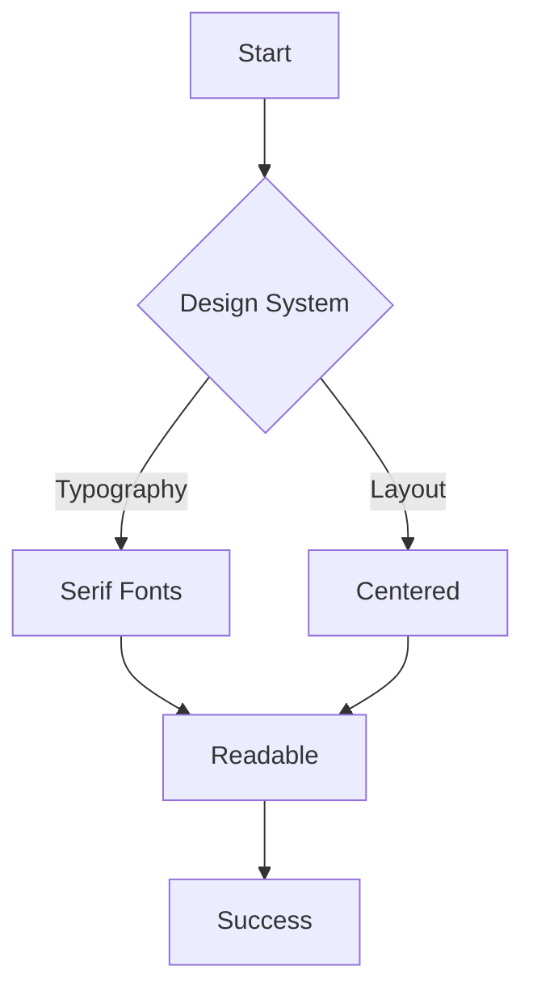

# Introduction

This is a test post to verify the **readability** of the new design system. We have switched to a clean, Medium-inspired layout with a focus on typography.

## Typography Check

This paragraph should be set in a nice serif font (Georgia or similar) with ample line height (1.8) to make reading comfortable. The width of this column should be restricted to approximately 700px.

> "Good design is as little design as possible." - Dieter Rams.

### Lists and Code

Here is a list of changes:
- Removed scanlines.
- Centered layout.
- Added Flowchart support.

```javascript
console.log("Hello, World!");
const design = "Clean";
```

## Flowchart Test

Below should be a rendered Mermaid diagram.



## Conclusion

If you can read this clearly and see the chart above, the system is working.
