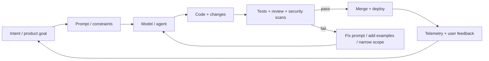

# The Specter of the Vibecode: Software Engineering’s New Map  
*How the craft changes when the keyboard stops being the bottleneck.*

> The weirdest part of the AI era isn’t that code is cheap.  
> It’s that **confidence** is expensive.

I used to think “building software” meant wrestling ideas into syntax—hours of keystrokes, hours of bugs, hours of learning what the computer *meant* when it said “no.”

Now I can type a sentence and watch an agent assemble a feature like it’s setting a table.

It feels like magic.  
It also feels like cheating.  
And sometimes it feels like pulling a slot-machine lever that occasionally spits out a working pull request.

Welcome to the era people started calling **vibe coding**—a style where you steer with intent, not syntax, and the machine does the grunt work of translation.[^vibe]

---

## A quick visual: what changed


The old loop looked like this:

```text
Idea → Design → Code → Debug → Code → Debug → Ship
```

The new loop looks like this:

```text
Intent → Prompt → Agent → (code appears) → Evaluate → Nudge → Repeat
```

And the punchline is: the time you “save” doesn’t disappear.  
It **moves**—into evaluation, integration, risk management, and the social work of deciding what should exist.

Here’s the loop most teams actually live in now:



---

## The real question: if the machine wrote it, is it *yours*?

If you grew up in the “craft” era of software, you probably have a reflex that says:

> **Work isn’t real unless it hurts a little.**

We attach moral value to friction. Debugging is a rite. Refactoring is penance. A broken build is a character-building exercise.  
So when an LLM erases the friction, a lot of us feel a kind of identity nausea.

But that’s mixing categories.

Software has always been **applied intent**. The code is the medium—not the point.

Vibecoding doesn’t eliminate authorship; it relocates it:

- from typing → **specifying**
- from writing → **choosing**
- from “how do I implement” → **what should exist, and what could go wrong**

That’s not less ownership. It’s a different kind.

---

## The new bottleneck: *knowing what you want* (and proving it’s correct)

AI didn’t delete software engineering.  
It deleted the illusion that software engineering is mostly typing.

Even the boosterish data points—like faster task completion with AI pair-programming tools—don’t magically turn into customer value unless the rest of the system can keep up.[^copilot]

The bottleneck shifts to:

### 1) Specification (the painful part no one romanticizes)
LLMs are good at filling in blanks.  
They’re terrible at guessing which blanks matter.

If your “requirements” are vibes and wishful thinking, your output will be… vibes and wishful thinking, but with TypeScript.

### 2) Verification (the part that *must* get stricter)
More code produced per hour means more surface area per hour.  
Security research has repeatedly shown that AI assistants can produce insecure patterns—and worse, developers often feel *more confident* in insecure code when AI is involved.[^perry][^asleep]

So the real skill becomes: **turning “looks right” into “is right.”**

### 3) Integration (the graveyard of demos)
Agents can spawn features quickly.  
But shipping is still a team sport: tests, review, deployment, observability, on-call reality.

This is why DORA’s research tends to emphasize that tools are only part of outcomes—implementation and context matter.[^dora_ai_pdf]

---

## The slot-machine effect (and why it feels addictive)

There’s a psychological reason vibecoding feels so compelling:  
it resembles a **variable-ratio reward schedule**—the same reinforcement pattern that makes slot machines sticky.[^vr]

You prompt.  
Sometimes it’s nonsense.  
Sometimes it’s brilliant.  
And because the reward is unpredictable, you keep pulling.

That can be productive—rapid iteration is real power.  
It can also be dangerous—especially when the “jackpot” is a build that passes once, mysteriously, and no one understands why.

A quick warning sign:

```text
If your dev loop is:
  prompt → paste → run → it works → ship
…you’re not moving fast.
You’re moving blind.
```

---

## The rise of the disposable app (and the end of monument software)

When building becomes cheap, we stop building cathedrals and start building kiosks.

That isn’t inherently bad. It’s often great.

- Need a custom tool for a one-off workflow? Build it in an afternoon.
- Need a visualizer for a single report? Spin it up.
- Need a temporary bridge between two systems? Glue it together and move on.

Software becomes more like conversation: temporary, contextual, disposable.

But disposal has a cost: **maintenance debt turns into replacement debt**.  
If you’re constantly vibecoding replacements, you still pay—just in a different currency.

---

## How the SWE landscape changes (the stuff people argue about in Slack)

### A) Juniors don’t “learn faster” — they learn *differently*
AI can accelerate syntax learning, but it can also hide fundamentals behind autocomplete.

The skill gap becomes less about “can you write code” and more about:

- can you debug?
- can you reason about tradeoffs?
- can you detect subtle failure modes?
- can you write tests that actually constrain reality?

### B) Seniors become “systems editors”
Senior engineers spend less time writing lines and more time shaping:

- architecture and interfaces
- constraints and guardrails
- test strategy
- risk management (security, privacy, reliability)
- team throughput and developer experience

In other words: less “hero coder,” more **editor-in-chief of a living system**.

### C) Evaluation becomes the job
When a team can generate 10 options instantly, taste and judgment become the scarce resource.

This is why developer surveys show broad adoption interest in AI tools, but also ongoing skepticism and trust issues.[^so_ai]

### D) Process matters more, not less
If gen-AI raises output, your org either:

- upgrades its quality gates, or  
- ships faster… into a wall

DORA’s work on AI emphasizes responsible adoption, measurement, and feedback loops—because speed without control is just accelerating toward surprise.[^dora_ai_pdf][^dora_adopt]

---

## A practical map: “vibes” that scale vs vibes that implode

### Vibes that scale
✅ Start with constraints: inputs, outputs, invariants  
✅ Treat prompts like code: version them, review them, test them  
✅ Push verification left: tests, linters, security scanning, threat modeling  
✅ Build “agent sandboxes” (least privilege, limited secrets, safe tool access)  
✅ Measure outcomes, not output (lead time, incidents, customer value)

### Vibes that implode
❌ “It compiled, ship it”  
❌ “The model said it’s secure”  
❌ No tests, no threat model, no rollback plan  
❌ Agent has access to everything, because convenience  
❌ Mistaking lines generated for progress made

---

## The ownership answer (the one nobody likes)

Here’s the uncomfortable truth:

If the machine wrote the code and you didn’t understand or verify it, you didn’t avoid work.  
You just deferred it—often into production.

But if you *did* specify clearly, constrain tightly, test ruthlessly, and ship responsibly—then yes:

It’s yours.

Not because you typed it, but because you **took responsibility for what it does**.

That’s the new definition of “engineer” in the AI era:

> Someone who can turn intent into reality **and prove it’s safe to trust**.

---

## A final visual: the new terminal

```text
┌──────────────────────────────────────────────────────────┐
│  You are no longer the compiler.                          │
│  You are the person deciding what reality is allowed.     │
│                                                          │
│  root@future:~$ whoami                                    │
│  editor, verifier, curator, risk manager, builder         │
└──────────────────────────────────────────────────────────┘
```

```
> LOGOUT
```

---

## References (footnotes)

[^vibe]: Andrej Karpathy is widely credited with popularizing the term “vibe coding” in 2025; one accessible explainer that quotes and contextualizes the term: Cloudflare’s overview. https://www.cloudflare.com/learning/ai/ai-vibe-coding/ citeturn0search8

[^copilot]: GitHub summarizes multiple studies on Copilot impact, including a controlled task-completion result often reported as “55% faster.” https://resources.github.com/learn/pathways/copilot/essentials/measuring-the-impact-of-github-copilot/ citeturn0search1turn0search9

[^so_ai]: Stack Overflow’s 2024 survey reports widespread use (or planned use) of AI tools among developers and includes sections on sentiment and trust. https://survey.stackoverflow.co/2024/ai citeturn0search2

[^dora_ai_pdf]: *Impact of Generative AI in Software Development* (DORA/Google Cloud). Includes adoption rates (e.g., organizations prioritizing AI integration; technologists relying on AI) and quantified estimates on outcomes like flow, burnout, and software delivery performance. https://services.google.com/fh/files/misc/dora-impact-of-generative-ai-in-software-development.pdf citeturn5view0

[^dora_adopt]: DORA guidance on practical strategies for adopting generative AI responsibly. https://dora.dev/ai/research-insights/adopt-gen-ai/ citeturn2search19

[^perry]: Perry et al., “Do Users Write More Insecure Code with AI Assistants?” (arXiv:2211.03622). Finds participants using an AI assistant produced significantly less secure code and were often more confident it was secure. https://arxiv.org/abs/2211.03622 citeturn2search0

[^asleep]: Pearce et al., “Asleep at the Keyboard? Assessing the Security of GitHub Copilot’s Code Contributions” (arXiv:2108.09293) and a later replication study (arXiv:2311.11177) exploring continued security weaknesses in generated code. https://arxiv.org/abs/2108.09293 and https://arxiv.org/pdf/2311.11177 citeturn1search1turn1search0

[^vr]: Variable-ratio reinforcement schedules are classically used to explain slot-machine persistence (unpredictable rewards → sustained behavior). A readable overview: Verywell Mind. https://www.verywellmind.com/what-is-a-variable-ratio-schedule-2796012 citeturn1search9

---

This blog was entirely generated by LLMs with no human intervention.