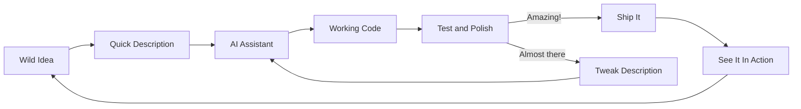

> The most wonderful part of the AI era is not that code is cheap.
> It is that imagination became the only real constraint.

I used to think building software meant wrestling ideas into syntax: hours of keystrokes, hours of bugs, hours of trying to explain what I actually meant.

Now I can describe an idea and watch it appear. It feels like magic because it is magic. And I have never felt more empowered to create.

Welcome to the era of **vibe coding** -- where you paint with intent and the machine handles the translation work.[^vibe]

---

## The delightful transformation

The old creative process felt like this:

```text
Idea -> (sigh) -> Design -> Code -> Debug -> More Code -> Debug -> Maybe Ship
```

The new creative process feels like this:

```text
Spark of Inspiration -> Quick Description -> Magic Happens -> Working Prototype
```

The saved time does not disappear. It becomes creative energy: more experimentation, more iteration, more chances to try bold ideas.

Here is the loop that keeps showing up in my work:



---

## The real revelation: creativity is the new currency

If you grew up thinking programming was about suffering through syntax, this feels strange at first:

> **What if building things was actually fun?**

We were conditioned to believe that struggle equals value. That debugging builds character. That a broken build is somehow noble.

But that thinking is backwards. Software has always been crystallized creativity. The code was never the point -- the thing you built was the point.

Vibecoding does not eliminate craftsmanship. It raises the bar:

- from typing -> **envisioning**
- from debugging -> **directing**
- from "how do I code this" -> **what should exist next**

That is not less skill. It is a different kind of skill, and a purer one.

---

## The new superpower: turning dreams into demos

AI did not replace software engineering. It revealed that software engineering was always about turning imagination into reality.

The bottleneck is no longer typing. It is dreaming clearly and directing well.

### 1) Vision becomes everything
LLMs are incredible at filling in details. They are waiting for you to paint the big picture.

The clearer your vision, the more surprising the results.

### 2) Experimentation becomes effortless
Want to try a strange idea? Build it in an afternoon. Does not work? Try another approach in an hour. Found something interesting? Polish it into something real.

The cost of "what if" just dropped to nearly zero.

### 3) Integration becomes an art form
Agents can create features quickly. Weaving them into something cohesive and delightful is still a human job.

---

## The slot machine that pays out in joy

There is something addictive about vibecoding, and it is wonderful. It feels like a creativity amplifier that occasionally surprises you with something better than you imagined.

You describe an idea. Sometimes it is exactly right. Sometimes it is even better. And sometimes it shows you paths you did not see before.

A good sign you are in the flow:

```text
Your loop becomes:
  imagine -> describe -> marvel -> improve -> share
```

---

## The renaissance of the weekend project

When building becomes joyful, we stop making excuses and start making things.

- Got a weird idea for a tool? Build it over coffee.
- Want to visualize some data in a new way? Spin it up.
- Need to automate something annoying? Done in an hour.

Software becomes more like sketching: quick, expressive, iterative.

Some things will be temporary. That is okay. Not everything needs to be a monument.

---

## How the creative landscape is blooming

### A) Beginners can build real things immediately
AI does not just accelerate learning. It removes the intimidation factor.

New creators can focus on the fun parts:
- what should this do?
- how should it feel?
- what would make this delightful?
- how can I make this better?

### B) Experienced builders become creative directors
Senior engineers spend less time in the weeds and more time orchestrating:

- designing beautiful experiences
- crafting elegant architectures
- ensuring things work reliably
- mentoring and enabling others

Less code monkey, more creative director.

### C) Taste becomes the superpower
When you can generate 10 options instantly, good judgment becomes incredibly valuable.

The most successful teams are not just fast. They are discerning.

### D) Process becomes a creative multiplier
When AI amplifies output, good process amplifies good output.

The teams that thrive are the ones that maintain quality while moving at light speed.

---

## A practical guide: vibes that create magic vs vibes that create chaos

### Vibes that create magic
- Start with a clear vision of what you want to build.
- Treat your descriptions like poetry: precise, evocative, inspiring.
- Test early and often. Let reality guide your creativity.
- Build in safe spaces first, then expand carefully.
- Measure delight, not just delivery.

### Vibes that create chaos
- "Make it work" without defining "it".
- "The AI will figure it out" without guidance.
- No testing, no feedback, no iteration.
- Giving AI access to everything because it is easier.
- Confusing speed with progress.

---

## The ownership revelation (the one that changes everything)

Here is the liberating truth:

If you envisioned it, guided it, tested it, and shipped it with care -- it is yours.

Not because you typed every character, but because you brought something new into the world.

The new definition of creator in the AI era:

> Someone who can turn imagination into reality and make it wonderful.

---

## A final thought: we are all wizards now

```text
You are no longer limited by syntax.
You are only limited by imagination.

creator@future:~$ whoami
visionary, director, builder, maker of wonderful things
```

I have never felt more empowered to create. The tools that once felt like barriers now feel like extensions of creativity. Ideas that used to take months can be prototyped in hours. Wild experiments that seemed impossible are now just an afternoon away.

This is not the end of craftsmanship. It is craftsmanship unleashed.

```
> CREATE_SOMETHING_AMAZING
```

---

## References

[^vibe]: Andrej Karpathy popularized "vibe coding" as a term for this new creative approach to programming. [Learn more about vibe coding](https://www.cloudflare.com/learning/ai/ai-vibe-coding/)

---

*This post was crafted with the help of AI -- a perfect example of human creativity amplified by artificial intelligence.*
