# The Magic of Vibecode: How LLMs Turned Me Into a Digital Wizard
*Or: How I learned to stop worrying and love rapid prototyping*

> The most wonderful part of the AI era isn't that code is cheap.  
> It's that **imagination** became the only real constraint.

I used to think "building software" meant wrestling ideas into syntax—hours of keystrokes, hours of bugs, hours of pleading with the computer to understand what I *actually* meant.

Now I can describe an idea and watch it spring to life like I'm casting a spell.

It feels like magic because it *is* magic.  
And I've never felt more empowered to create.

Welcome to the era of **vibe coding**—where you paint with intent instead of syntax, and the machine handles the tedious translation work.[^vibe]

---

## The delightful transformation

The old creative process felt like this:

```text
Idea → (sigh) → Design → Code → Debug → More Code → Debug → Maybe Ship
```

The new creative process feels like this:

```text
Spark of Inspiration → Quick Description → ✨Magic Happens✨ → Working Prototype!
```

And here's the beautiful part: all that "saved" time doesn't vanish—it transforms into pure creative energy. More time for experimentation, iteration, and turning wild ideas into reality.

Here's what my actual creative loop looks like now:

```mermaid
flowchart LR
  A[💡 Wild Idea] --> B[📝 Quick Description]
  B --> C[🤖 AI Assistant]
  C --> D[✨ Working Code]
  D --> E[🎯 Test & Polish]
  E -->|Amazing!| F[🚀 Ship It]
  E -->|Almost there| G[🔧 Tweak Description]
  G --> C
  F --> H[📊 See It In Action]
  H --> A
```



---

## The real revelation: creativity is the new currency

If you grew up thinking programming was about suffering through syntax, this might feel strange at first:

> **What if building things was actually... fun?**

We've been conditioned to believe that struggle equals value. That debugging builds character. That a broken build is somehow noble.

But that's backwards thinking.

Software has always been **crystallized creativity**. The code was never the point—the *thing you built* was the point.

Vibecoding doesn't eliminate craftsmanship; it elevates it:

- from typing → **envisioning**
- from debugging → **directing**
- from "how do I code this" → **what amazing thing should exist next**

That's not less skill. It's *pure* skill.

---

## The new superpower: turning dreams into demos

AI didn't replace software engineering.  
It revealed that software engineering was always about **turning imagination into reality**.

The bottleneck isn't typing anymore—it's dreaming big enough.

### 1) Vision becomes everything
LLMs are incredible at filling in details.  
They're waiting for you to paint the big picture.

The clearer your vision, the more magical the results. It's like having a genie that actually understands your wishes.

### 2) Experimentation becomes effortless
Want to try a crazy idea? Build it in an afternoon.  
Doesn't work? Try another approach in an hour.  
Found something interesting? Polish it into something beautiful.

The cost of "what if" just dropped to nearly zero.

### 3) Integration becomes an art form
Sure, agents can create features quickly.  
But weaving them into something cohesive and delightful? That's where human creativity shines.

---

## The slot machine that pays out in joy

There's something addictive about vibecoding, and it's wonderful:  
it's like having a creativity amplifier that occasionally surprises you with pure genius.

You describe an idea.  
Sometimes it's exactly what you pictured.  
Sometimes it's even better than what you imagined.  
And sometimes it shows you possibilities you never considered.

That unpredictability isn't a bug—it's a feature. It keeps the creative process fresh and exciting.

A good sign you're in the flow:

```text
Your dev loop becomes:
  imagine → describe → marvel → improve → share
```

---

## The renaissance of the weekend project

When building becomes joyful, we stop making excuses and start making things.

This is absolutely wonderful:

- Got a weird idea for a tool? Build it over coffee.
- Want to visualize some data in a new way? Spin it up.
- Need to automate something annoying? Done in an hour.

Software becomes more like sketching: quick, expressive, iterative.

And yes, some things are temporary. But that's okay! Not everything needs to be a monument. Sometimes you just want to see if an idea has legs.

---

## How the creative landscape is blooming

### A) Beginners can build real things immediately
AI doesn't just accelerate learning—it removes the intimidation factor.

New creators can focus on the fun parts:
- what should this do?
- how should it feel?
- what would make this delightful?
- how can I make this better?

### B) Experienced builders become creative directors
Senior engineers spend less time in the weeds and more time orchestrating:

- designing beautiful experiences
- crafting elegant architectures  
- ensuring things work reliably
- mentoring and enabling others

Less "code monkey," more **creative visionary**.

### C) Taste becomes the superpower
When you can generate 10 options instantly, having good judgment becomes incredibly valuable.

This is why the most successful teams aren't just fast—they're *discerning*.

### D) Process becomes a creative multiplier
When AI amplifies output, good process amplifies *good* output.

The teams that thrive are the ones that figure out how to maintain quality while moving at light speed.

---

## A practical guide: vibes that create magic vs vibes that create chaos

### Vibes that create magic
✅ Start with a clear vision of what you want to build  
✅ Treat your descriptions like poetry: precise, evocative, inspiring  
✅ Test early and often—let reality guide your creativity  
✅ Build in safe spaces first, then expand carefully  
✅ Measure delight, not just delivery

### Vibes that create chaos
❌ "Make it work" without defining "it"  
❌ "The AI will figure it out" without guidance  
❌ No testing, no feedback, no iteration  
❌ Giving AI access to everything because it's easier  
❌ Confusing speed with progress

---

## The ownership revelation (the one that changes everything)

Here's the liberating truth:

If you envisioned it, guided it, tested it, and shipped it with care—it's absolutely yours.

Not because you typed every character, but because you **brought something new into the world**.

The new definition of "creator" in the AI era:

> Someone who can turn imagination into reality **and make it wonderful**.

---

## A final thought: we're all wizards now

```text
┌──────────────────────────────────────────────────────────┐
│  You are no longer limited by syntax.                     │
│  You are only limited by imagination.                     │
│                                                          │
│  creator@future:~$ whoami                                 │
│  visionary, director, builder, maker of wonderful things  │
└──────────────────────────────────────────────────────────┘
```

I've never felt more empowered to create. The tools that once felt like barriers now feel like extensions of my creativity. Ideas that used to take months can be prototyped in hours. Wild experiments that seemed impossible are now just an afternoon away.

This isn't the end of craftsmanship—it's craftsmanship unleashed.

```
> CREATE_SOMETHING_AMAZING
```

---

## References

[^vibe]: Andrej Karpathy popularized "vibe coding" as a term for this new creative approach to programming. [Learn more about vibe coding](https://www.cloudflare.com/learning/ai/ai-vibe-coding/)

---

*This blog post was crafted with the help of AI—a perfect example of human creativity amplified by artificial intelligence.*
