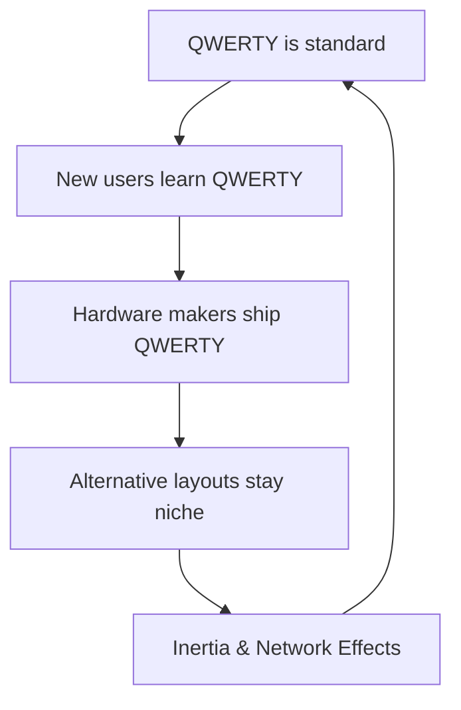

If you’ve spent any time in enthusiast circles, you’ve heard the gospel of the alternative layout. "QWERTY was designed to slow you down!" they claim. "Dvorak/Colemak will save your wrists and make you a typing god!"

The truth is a bit more complicated, and significantly more human.

### The Myth of QWERTY's Sabotage

The most common story is that Christopher Sholes designed QWERTY to slow typists down so that physical hammers on typewriters wouldn't jam. This is mostly a myth. QWERTY was actually designed to separate common letter pairs (bigrams) so their hammers wouldn't hit *each other*—a subtle but important distinction. It was about hardware throughput, not human speed limits.

### The Dvorak Dream

In 1936, August Dvorak patented his "Simplified Keyboard." His pitch:
- **Home Row Dominance:** Most common letters live on the home row.
- **Hand Alternation:** Typing should feel like a rhythmic drum beat between hands.
- **Finger Distance:** Reduce the "miles" your fingers travel per day.

On paper, Dvorak is objectively superior. In practice, the gains are marginal. Studies show that once you reach a certain level of proficiency, the bottleneck isn't finger travel—it's cognitive load and the speed of your mental "lookahead."

### Why We Can't Quit QWERTY

We are stuck in a classic path-dependency loop. But there's another reason: **Shortcuts.**

The modern OS is built around `Ctrl+C`, `Ctrl+V`, `Ctrl+X`, and `Ctrl+Z`. On a Dvorak layout, those four keys are scattered across the board. You don't just lose muscle memory for words; you lose it for the tools that build them.

### The Real Ergonomic Fix

Switching layouts is a massive investment (weeks of frustration) for a ~5-10% gain. If you actually want to save your wrists, don't look at the layout—look at the **hardware**.

1. **Split Keyboards:** Separating the halves allows for a neutral shoulder width.
2. **Tent:** Angling the keyboard upward prevents forearm pronation.
3. **Columnar Stagger:** Keyboards like the Ergodox or Moonlander align keys with your fingers, not in arbitrary diagonal rows left over from typewriter mechanics.

### The Verdict

The "best" layout is the one that doesn't make you think. If you’re already fast on QWERTY, stay there. If you want a hobby, learn Colemak. But remember: the bottleneck is rarely the keys—it's the ideas behind them.
