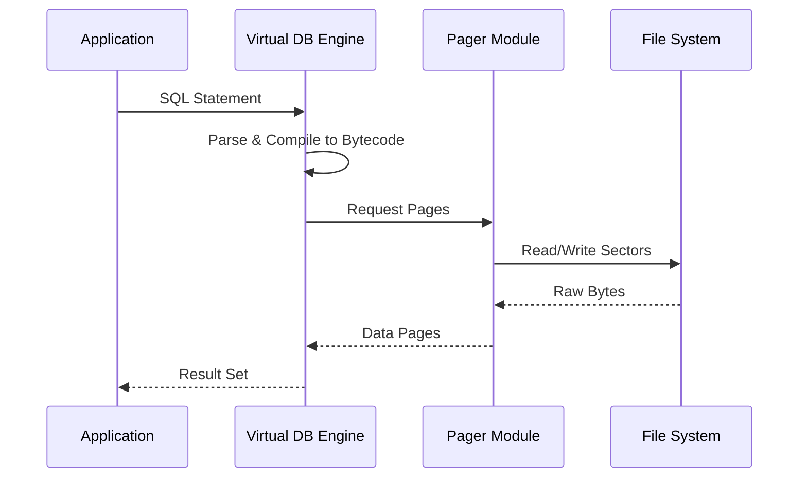

Every time you send a text, open a browser tab, or start your car, you are likely interacting with **SQLite**. It is arguably the most widely deployed piece of software in existence, yet it remains invisible by design.

### What is SQLite?

Unlike traditional databases (PostgreSQL, MySQL) which are *services* you connect to over a network, SQLite is a *library*. It’s a C-language library that implements a small, fast, self-contained, high-reliability, full-featured, SQL database engine.

Your database isn't a server; it's a **file**.

### The Testing Obsession

The real reason SQLite is everywhere isn't just because it's fast—it's because it's **indestructible**. The SQLite project is famous for its testing rig, called **TH3** (Test Harness #3).

- **100% Branch Coverage:** Every single path the code can take is tested.
- **Billions of test cases:** They run massive simulations of power failures and disk corruption to ensure the database can always recover.
- **Aviation-Grade Reliability:** Much of the code is tested with the same rigor as flight control software.

### When to Use (and When to Walk Away)

SQLite is perfect for:
- **Embedded systems:** IoT devices, phones, watches.
- **Application data files:** Think of it as a better alternative to JSON or XML for saving state.
- **Low-to-medium traffic websites:** Yes, you can run a site on SQLite (this blog could, if it weren't static).

SQLite is NOT for:
- **High-concurrency writes:** Only one process can write to the file at a time.
- **Client/Server architectures:** If your app lives on 10 different servers, they can't all share one SQLite file easily.

### The Architecture of a Query

### The Beauty of the Library

There is something elegant about a system that doesn't require a DBA, a config file, or a socket. It just asks for a file descriptor and gets to work. In an era of increasingly complex cloud-native microservices, SQLite is a reminder that sometimes, the simplest architecture is the most powerful one.
