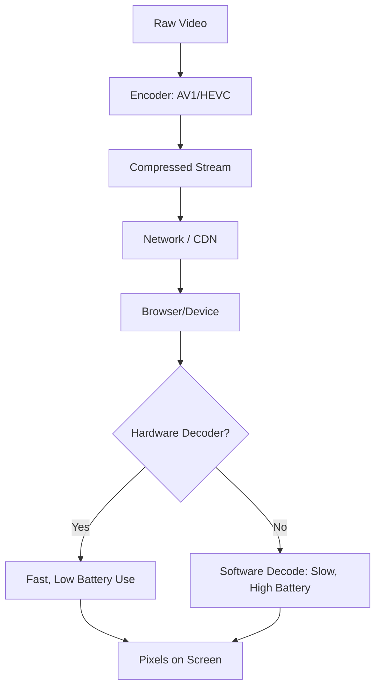

If you watch a video on YouTube, you’re likely using **VP9** or **AV1**. If you watch a movie on Netflix on your TV, you’re likely using **HEVC**. If you're on a FaceTime call, it's **H.264**.

Why don't we just have one "best" way to compress video? Because video codecs are as much about **law** as they are about **math**.

### The Math: Efficiency vs. Complexity

Every new generation of video codec aims to cut the file size in half without losing quality.
- **H.264 (AVC):** The old reliable. Plays on a toaster. 
- **H.265 (HEVC):** 50% better than H.264, but requires much more CPU power to encode/decode.
- **AV1:** The new challenger. Royalty-free and slightly more efficient than HEVC.

### The Law: Patent Pools

This is where things get messy. **HEVC** (High Efficiency Video Coding) is technically brilliant but legally cursed. It is owned by multiple patent pools (MPEG-LA, HEVC Advance, Velos Media). If you want to build a phone that decodes HEVC, you have to pay royalties to multiple companies.

**AV1** was created by the **Alliance for Open Media** (Google, Amazon, Apple, Microsoft, Netflix) specifically to kill HEVC's royalty model. It is designed to be "royalty-free," though patents are still being contested in court.

### The Playback Pipeline

### Why It Matters to You

If your browser supports **AV1** and the website provides it, you get higher quality video on a slower connection. If your phone has an **HEVC hardware decoder**, you can watch 4K video for 10 hours without your phone turning into a hand-warmer.

### The Future: VVC and Beyond

Even as AV1 gains ground, the "next" standard—**VVC (Versatile Video Coding)**—is already here. It’s even more efficient, but it brings back the same complex licensing issues that hampered HEVC.

The Codec Wars are a reminder that in tech, the most "technically superior" solution doesn't always win. The winner is often the one that can navigate the minefield of intellectual property without stepping on too many royalties.
