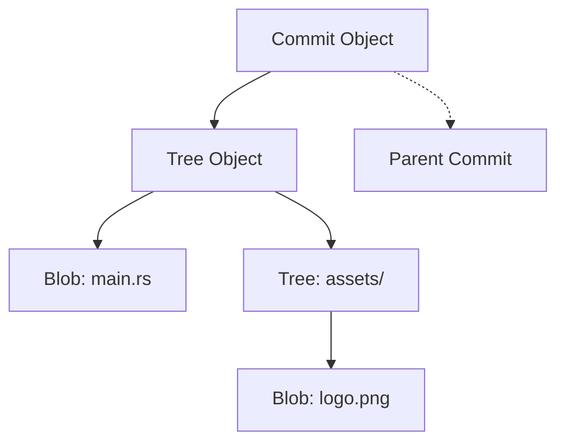

Most developers use Git as a set of magic spells: `git add`, `git commit`, `git push`. But if you look under the hood (specifically in the `.git/objects` directory), you’ll find a remarkably simple and elegant architecture.

Git isn't tracking "changes" or "diffs." It's tracking **content**.

### The Three Pillars

There are three main types of objects in the Git universe:

1. **Blobs (Binary Large Objects):** These store the *content* of a file. Notice I didn't say the *filename* or the *permissions*. Just the bytes. If you have two files with the exact same content, Git only stores one blob.
2. **Trees:** These are like directories. A tree maps filenames to blobs or other trees. This is where your folder structure lives.
3. **Commits:** A commit is just a pointer to a specific **Tree**, along with metadata (author, date, message) and a pointer to a **Parent Commit**.

### Content-Addressable Storage

Everything in Git is indexed by its **SHA-1 hash**. 

When you change a single character in a file:
1. Git creates a new **Blob** for that file.
2. Git creates a new **Tree** that points to the new blob (and all the old, unchanged blobs).
3. Git creates a new **Commit** that points to the new tree.

This sounds inefficient—"Wait, it copies the whole tree every time?"—but because Git uses pointers (hashes), the "copy" is just a tiny text file of hashes. It’s incredibly fast.

### The "Delta" Magic

You might be thinking: "If Git stores a new blob every time I change a line, my `.git` folder must be huge!"

This is where **Packfiles** come in. Periodically (or when you run `git gc`), Git looks for objects that are very similar and stores one of them as a "delta" (a diff) against the other. This happens at the storage layer, completely separate from the logical object model.

### Why This Matters

Understanding the object model turns Git from a confusing CLI into a predictable data structure.
- **Detached HEAD?** You just moved the `HEAD` pointer to a commit hash instead of a branch name.
- **Rebase?** You’re literally rewriting a chain of commit objects with new parents.
- **Hard Reset?** You’re just moving a branch pointer to a different hash.

Git is just a directed acyclic graph (DAG) of content. Once you see the graph, the commands make sense.
