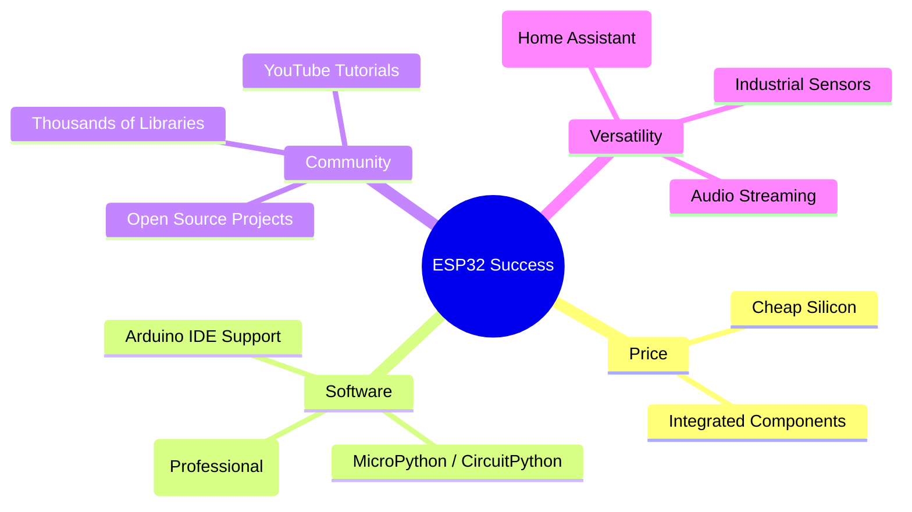

Ten years ago, if you wanted to connect a microcontroller to WiFi, it was a nightmare. You bought an Arduino ($30), a WiFi shield ($40), and spent three days fighting with buggy SPI libraries just to send a "Hello World" to a server.

Then came **Espressif Systems**.

### The ESP8266 Shockwave

In 2014, the ESP8266 appeared on the market for about $2. It was a tiny chip that had WiFi built-in. At first, the documentation was only in Chinese, but the "hacker" community translated it overnight. Suddenly, the cost of "connecting a thing" dropped by 95%.

### The King: ESP32

The **ESP32**, released in 2016, took that success and turned it into an industry standard. For roughly $3, you get:
- **Dual-core CPU** (240MHz)
- **WiFi and Bluetooth** (Classic + LE)
- **Massive I/O:** Capacitive touch, ADC, DAC, I2C, SPI, UART, and hardware encryption.
- **Low Power:** It can sleep for years on a battery and wake up on a timer.

### Why it Won

It wasn't just the price. It was the **ecosystem**.

### The Disruption of Arduino

Arduino (the company) was slow to adapt. While they were still selling 8-bit chips with no connectivity for $20, hobbyists were moving to the ESP32. Today, most "Arduino" projects you see online aren't actually running on Arduino hardware—they're running the Arduino *software* on an ESP32.

### The Modern IoT Landscape

Today, the ESP32 is inside your smart bulbs, your connected appliances, and your DIY weather stations. It proved that you don't need a Raspberry Pi to do "smart" things. You just need a chip that's cheap enough to be disposable and powerful enough to be useful.

The ESP32 is a reminder that in hardware, **accessibility is the ultimate feature.**
