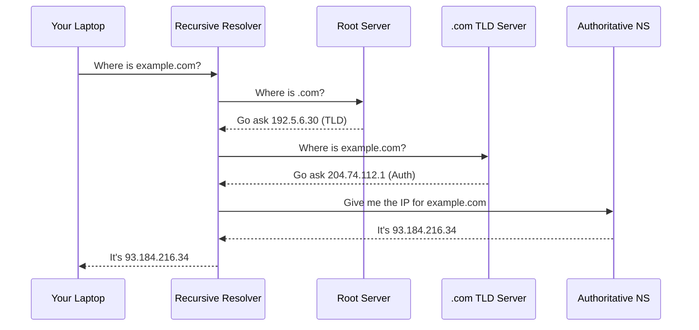

When you type `google.com`, your computer doesn't know where that is. It has to ask. The system that answers that question—the **Domain Name System (DNS)**—is essentially a distributed, global phone book.

It was designed in 1983. It has no built-in security. And if it stops working, the internet essentially disappears.

### The Hierarchy of a Request

DNS isn't one big server. It's a tree.

1. **The Recursive Resolver:** Usually provided by your ISP or Google (8.8.8.8). It does the "searching" for you.
2. **The Root Servers:** There are 13 "named" root servers (A through M), though they are actually hundreds of physical servers spread globally via **Anycast**. They tell you where to find the `.com` or `.org` servers.
3. **TLD (Top-Level Domain) Nameservers:** These manage specific extensions like `.com`.
4. **Authoritative Nameservers:** The final stop. This is the server that actually knows the IP address of `google.com`.

### The Resolution Loop

### The Security Gap (DNSSEC)

Because DNS was designed in an era of "trust," it’s vulnerable to **DNS Cache Poisoning**. An attacker can lie to a resolver and say `bankofamerica.com` is at a malicious IP.

**DNSSEC** adds digital signatures to DNS records to prevent this, but adoption is slow and complex.

### Why "13" Root Servers?

You'll often hear that there are only 13 root servers. This is a technical limitation of the original **UDP** packet size (512 bytes). To fit all the addresses into a single response, they could only fit 13. 

Today, we use **Anycast** to make those 13 IP addresses point to over 1,000 different physical locations, ensuring that if one goes down, the rest of the world doesn't notice.

### The Ultimate Fragility

DNS is a reminder that the modern web is built on ancient foundations. We've layered encryption (DoH/DoT) and speed on top, but at the end of the day, we are all just trusting a chain of servers to tell us where the bits are. 
