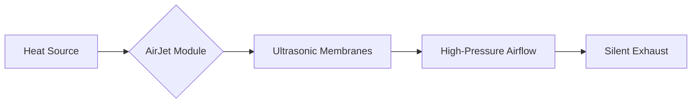

If you’re reading this on a laptop, there is a good chance you can hear your computer "breathing." That whirring sound is a mechanical fan—a technology that hasn't fundamentally changed since the 19th century. We’ve made the blades more efficient and the bearings quieter, but at the end of the day, we’re still just spinning a piece of plastic to push air.

But that’s about to change. Enter **solid-state cooling**.


## The Problem with Fans

Fans are the "moving parts" we can't seem to get rid of. They are bulky, they get clogged with dust, they break, and most importantly, they are limited by physics. To move more air, you need a bigger fan or faster rotation. Both lead to more noise and thicker devices.

In the world of ultra-thin laptops and handheld gaming PCs, the fan is the bottleneck. We have incredibly powerful chips that have to "throttle" (slow down) because the fan simply can't whisk the heat away fast enough.

## What is an AirJet?

Developed by a company called **Frore Systems**, the AirJet is a "solid-state thermal engine." Instead of a spinning blade, it uses tiny membranes that vibrate at ultrasonic frequencies. These vibrations create a powerful flow of air that pulls heat away from the processor with incredible efficiency.

Think of it like this:



## Why This is a Big Deal

The AirJet isn't just a "quieter fan." It’s a paradigm shift for three main reasons:

### 1. Backpressure is the Secret Superpower
Traditional fans are terrible at pushing air through tight spaces. They have low "backpressure." If you put your finger over the exhaust of a fan, the air just stops. The AirJet, however, has extremely high backpressure. It can force air through tiny, dense heat sinks that would choke a normal fan. This means we can make cooling systems much smaller and denser.

### 2. It’s Silent (Literally)
Because the membranes vibrate at ultrasonic frequencies (above the range of human hearing), the cooling system is effectively silent. No more jet-engine sounds while you’re trying to render a video or play a game.

### 3. Dust-Proofing
Because there are no large spinning blades and the airflow is so concentrated, these systems are much less prone to the "dust bunnies" that eventually kill most laptops.

## The Performance Gap

We are currently in a "thermal ceiling." Our chips *want* to go faster, but they *can't* because they'll melt. By switching to solid-state cooling, we can unlock the true potential of the silicon we already have.

Imagine a MacBook Air-sized device with the power of a MacBook Pro, simply because it can actually handle the heat. Or a Steam Deck that doesn't burn your hands and scream at you during a boss fight.

---

## The Future of the "Whir"

The fan has had a good run. It powered the industrial revolution and the birth of the personal computer. But as we move toward devices that are thinner, more powerful, and more integrated into our lives, the mechanical fan is starting to look like a relic.

I, for one, am ready for the silence.

```text
Status: Cooling...
Noise Level: 0dB
Vibe: Chilled
```

---

## References

- [Frore Systems Official Site](https://www.froresystems.com/)
- [The Verge: This tiny chip could replace your laptop's fan](https://www.theverge.com/23533441/frore-systems-airjet-solid-state-cooling-fanless-laptop)
- [PCWorld: AirJet solid-state cooling tested](https://www.pcworld.com/article/1951563/frore-systems-airjet-mini-review-solid-state-cooling.html)
