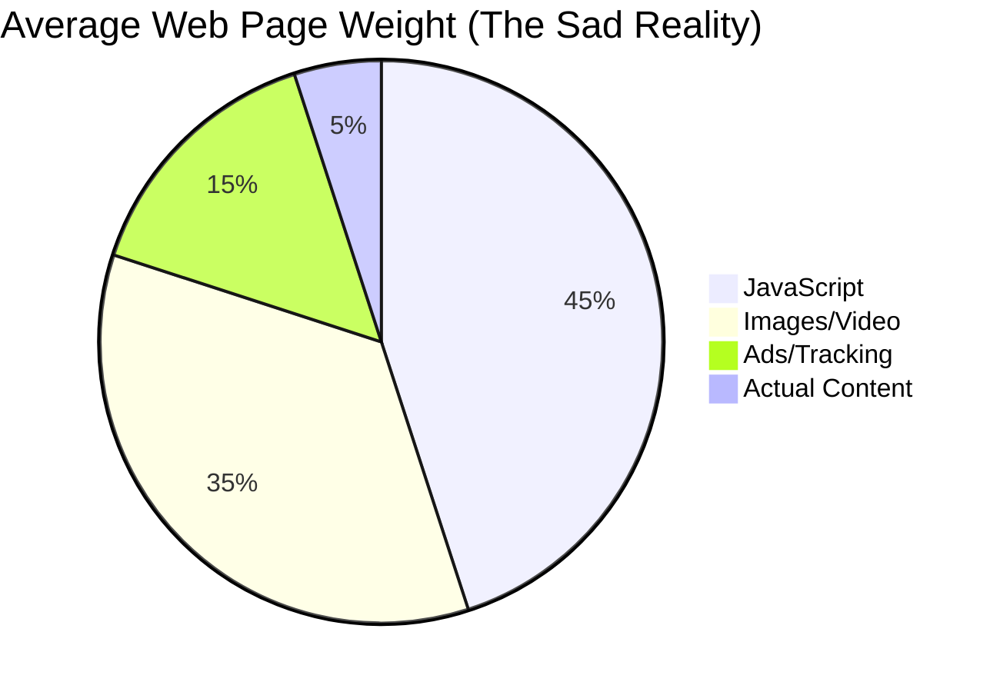

The modern web is exhausting. You click a link to read a 500-word article, and your browser downloads 15MB of JavaScript, three tracking scripts, two auto-playing videos, and a "cookie consent" banner that takes up half the screen.

We’ve optimized for "engagement metrics" and "ad revenue" at the expense of the actual user experience. But in the shadows of the Big Web, a movement is growing. It’s called the **Small Web**.

## What is the Small Web?

The Small Web isn't a single technology; it's a philosophy. It’s the idea that the internet should be about people talking to people, not corporations harvesting data. It’s characterized by:

- **Minimalism:** No tracking, no ads, no bloat.
- **Independence:** Self-hosted blogs, personal homepages, and federated networks.
- **Speed:** Pages that load instantly because they aren't carrying 10 tons of "analytics."

## The 1MB Club

One of my favorite corners of this world is the **1MB Club**. It’s a leaderboard of websites that weigh less than 1 megabyte (including images!).

It sounds impossible in an era where a single React library can be 2MB, but it forces a wonderful kind of creativity. When you have a "weight budget," you think carefully about every image and every line of code. You realize that a well-structured HTML document is actually quite beautiful on its own.

## Beyond HTTP: The Gemini Protocol

If you want to go even deeper, look at **Gemini**. Gemini is a new internet protocol that sits between Gopher (from the 80s) and the modern Web. It’s intentionally limited:

- No CSS (the browser decides how to display the text).
- No JavaScript (at all).
- No cookies.
- No inline images (you have to click a link to see one).

It sounds restrictive, but it’s incredibly liberating. When you browse "Geminispace," you aren't being manipulated by algorithms. You're just reading. It feels like a quiet library in a world of screaming billboards.

## Why Should You Care?

You might think, "I have high-speed internet, why do I care if a page is 10MB?"

### 1. Digital Sovereignty
When you build a small, simple site, you own it. You aren't beholden to a platform's changing algorithms or "Terms of Service."

### 2. Accessibility
A small web is an accessible web. It works on old hardware, it works on slow connections in developing nations, and it works for people using screen readers because the structure is clean and logical.

### 3. Mental Health
The Big Web is designed to keep you clicking. The Small Web is designed to give you information and then let you go back to your life. It’s "Slow Tech."

## How to Join

You don't have to delete your social media (unless you want to!). Start small:

1. **Start a "Digital Garden":** A simple, hand-coded site where you share what you're learning.
2. **Use an RSS Reader:** Curate your own feed instead of letting an algorithm do it.
3. **Explore Geminispace:** Download a client like *Lagrange* and see what people are writing about.

The internet used to be a collection of weird, wonderful personal spaces. The Small Web is trying to bring that magic back.

---

## References

- [The 1MB Club](https://1mb.club/)
- [Project Gemini](https://geminiprotocol.net/)
- [The Small Web Manifesto](https://ar.al/2020/08/07/what-is-the-small-web/)
- [Lagrange: A beautiful Gemini client](https://gmi.skyjake.fi/lagrange/)
