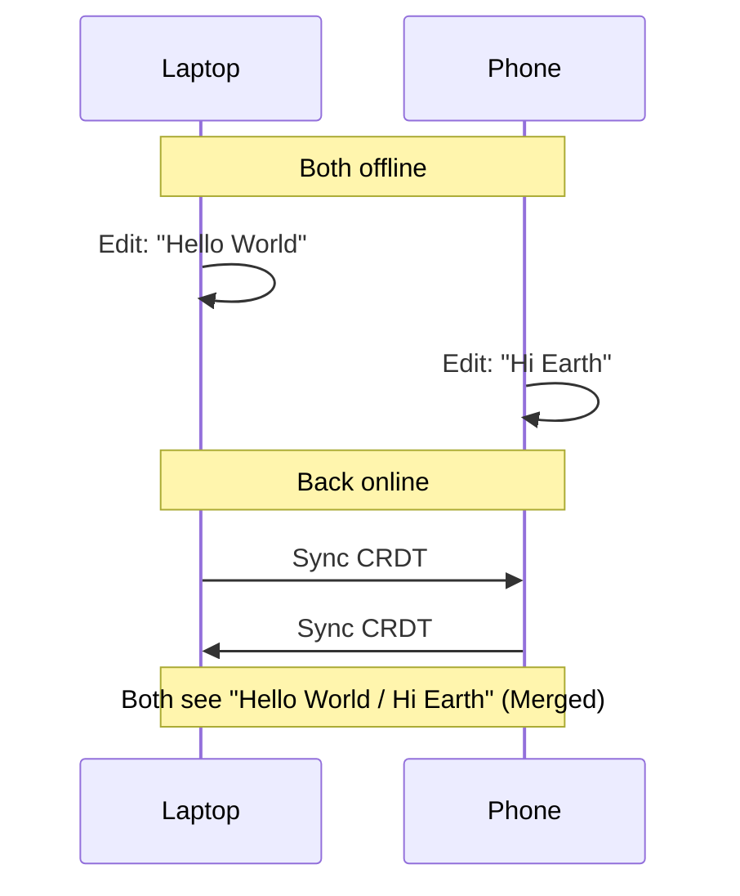

For the last decade, we’ve been told that "The Cloud" is the future. Everything from our notes to our spreadsheets to our family photos lives on someone else's computer.

And for a while, it was great. We got seamless sync and collaboration. But we also got "subscription fatigue," data breaches, and that annoying "Loading..." spinner when the Wi-Fi is spotty.

But a new movement is bubbling up: **Local-First Software**.

## What is Local-First?

Local-first isn't just "offline mode." It’s a fundamental architectural shift. In a local-first app:

1. **The primary copy of your data is on your device.**
2. **The app works fully without an internet connection.**
3. **Syncing to other devices happens in the background, peer-to-peer or via a server you control.**

It combines the speed and ownership of traditional desktop apps with the collaboration and sync of the cloud.

## The Seven Ideals

The researchers at **Ink & Switch** defined seven ideals for local-first software. Here are the ones I find most compelling:

### 1. No "Loading" Spinners
Because the data is local, the UI is instantaneous. You don't wait for a server to "acknowledge" your keystroke.

### 2. Multi-device Sync
Your phone, tablet, and laptop stay in sync. But unlike Google Docs, they don't *need* a central server to do it.

### 3. Network Optional
Whether you’re in a tunnel, on a plane, or in a rural cabin, the app works exactly the same. When you get back online, everything merges seamlessly.

### 4. Long-term Preservation
If the company that made the app goes out of business tomorrow, your data is still on your hard drive, and the app still works. No "End of Life" for your own notes.

## The Magic Sauce: CRDTs

How do you sync data between devices without a central "Source of Truth" telling everyone who is right? The answer is **Conflict-free Replicated Data Types (CRDTs)**.

CRDTs are specialized data structures that can be updated independently and concurrently without needing a central coordinator. They are designed so that any two devices that have seen the same set of updates will always arrive at the exact same state.

## Why This Matters Now

We are reaching "Peak Cloud." People are realizing that having their entire digital life locked inside proprietary silos is a risk. We’ve seen apps disappear, prices hike, and "AI features" forced into our private spaces without consent.

Local-first is about **Digital Sovereignty**. It’s about the realization that "The Cloud" is just a convenience, not a requirement.

## Apps to Watch

If you want to experience the local-first future, check out these projects:

- **Anytype:** A "no-code" operating system for your life, built on IPFS.
- **Logseq:** A privacy-first, open-source knowledge base that lives on your local markdown files.
- **Obsidian:** (Mostly) local-first note-taking with a massive plugin ecosystem.
- **Loft:** A new way to collaborate on documents that feels like magic.

The era of "Cloud-First" was about connectivity. The era of "Local-First" is about **control**.

---

## References

- [Ink & Switch: Local-first software](https://www.inkandswitch.com/local-first/)
- [The CRDT Primer](https://crdt.tech/)
- [Anytype.io](https://anytype.io/)
- [Logseq](https://logseq.com/)
