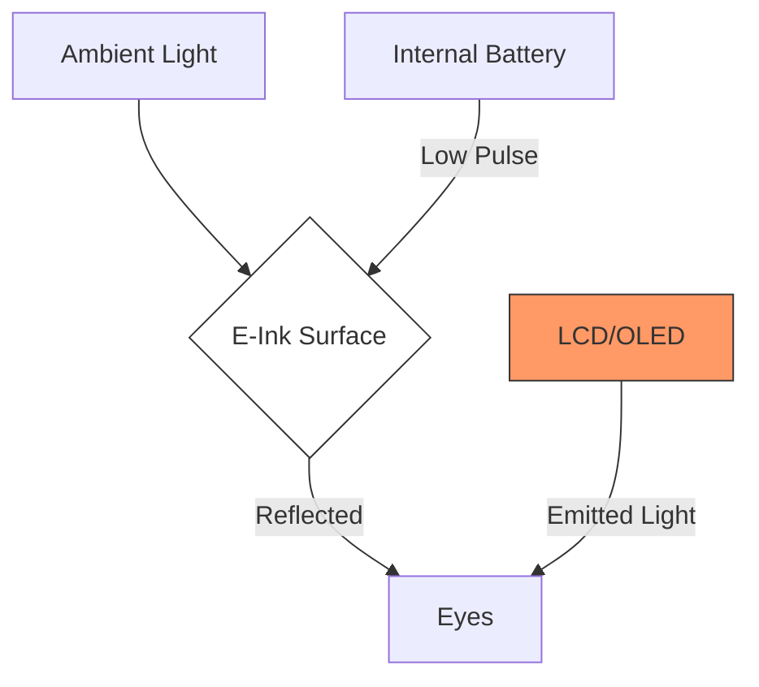

We spend our lives staring into light bulbs.

Whether it’s an OLED iPhone, a Mini-LED MacBook, or a high-refresh gaming monitor, these screens all share one trait: they are **emissive**. They blast light directly into your retinas. It’s no wonder our eyes feel like sandpaper by 5:00 PM.

But for the first time in a decade, there is real excitement in the world of **Reflective Displays**. We are entering the E-Ink Renaissance.

## Why E-Ink Was "Stuck"

For a long time, E-Ink was synonymous with "slow." It was great for reading a book on a Kindle, but terrible for anything else. The refresh rate was measured in seconds, not milliseconds, and color was a muddy, ghosting mess.

The limitations were physical. E-Ink works by moving tiny charged particles (white, black, or color) through a fluid. Moving those physical particles takes time and energy.

## The Breakthrough: Gallery 3 and Kaleido 3

Two new technologies from E Ink Holdings have changed the game:

1. **Kaleido 3:** This uses a color filter array on top of a standard black-and-white display. It’s fast, relatively bright, and great for comics or textbooks.
2. **Gallery 3:** This is the "Holy Grail"—it uses four different color particles (Cyan, Magenta, Yellow, White) in every pixel. It produces much richer, more accurate colors without needing a filter.

But the real magic isn't just color; it's **speed**.

## The Rise of "E-Ink Monitors"

Companies like **Dasung** and **Boox** are now making E-Ink displays that can actually play video. They do this through incredibly clever software "dithering" and high-voltage pulses that force the particles to move faster than they were ever meant to.

It’s not "Retina quality," and you won't be playing *Cyberpunk 2077* on it, but for coding, writing, or browsing the web? It’s a revelation.

## The "Daylight" Computer

There is even a new category appearing: **RLCD (Reflective LCD)**. A company called **Daylight Computer** recently released a tablet that uses a high-speed reflective display with no backlight. It feels like paper, but refreshes at 60Hz.

It’s the middle ground we’ve been waiting for: the eye-comfort of E-Ink with the fluidity of a modern iPad.

## Why This Matters (Beyond Eye Strain)

### 1. Battery Life
Because reflective displays only use power when the image *changes*, a device can stay on for weeks. Imagine a laptop that never needs to be plugged in during the workday.

### 2. Outdoor Visibility
Emissive screens fight the sun (and usually lose). Reflective screens **love** the sun. The brighter the environment, the better the screen looks.

### 3. Focus
There is a psychological component to these screens. Because they aren't "vibrant" and "pulsing" with saturated colors, they are less addictive. They feel more like a tool and less like a slot machine.

## The Future is Matte

I think we’ve reached the limit of how much light we can blast at ourselves. The next frontier of "Premium" hardware isn't more nits of brightness—it's the luxury of a screen that feels like a physical object in the room.

The E-Ink Renaissance is just getting started. I'm writing this on a glowing screen, but I hope my next post is written on a reflective one.

---

## References

- [E Ink Holdings: Technology Overview](https://www.eink.com/tech.html)
- [Daylight Computer Co.](https://daylightcomputer.com/)
- [Dasung: Paper-like Monitors](https://dasung-tech.myshopify.com/)
- [The Verge: Why E-Ink is finally getting good](https://www.theverge.com/23719463/e-ink-gallery-3-color-e-reader-tech)
