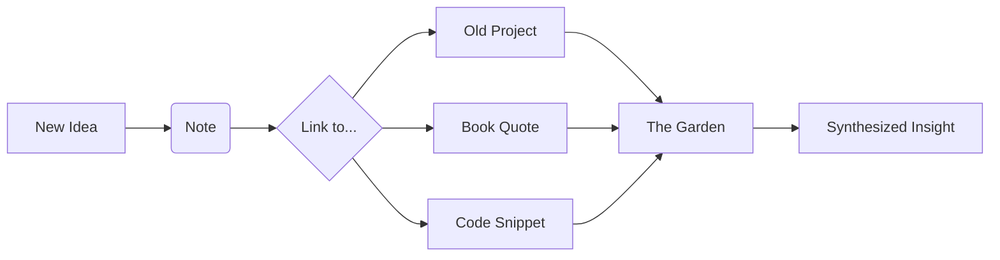

We have become consumers of "The Feed."

Whether it’s X (Twitter), LinkedIn, or Reddit, we spend our time in a river of chronological, ephemeral content. You see a brilliant thought, you scroll past it, and it's gone forever—buried under a thousand more thoughts.

But there is an alternative way to be online. It’s called **Digital Gardening**.

## The Stream vs. The Garden

The "Stream" is what we’re used to:
- **Time-bound:** Newest is always at the top.
- **Performative:** Designed for likes and retweets.
- **Ephemeral:** Content has a half-life of about 4 hours.

The "Garden" is different:
- **Topological:** Content is organized by *ideas*, not dates.
- **Private (first):** Built for your own understanding, not for an audience.
- **Evergreen:** Posts are never "finished." They are seeds that you water and prune over years.

## Why Gardening?

The goal of a digital garden isn't to "ship content." It's to **think better.**

When you know you're building a long-term resource, your relationship with information changes. Instead of trying to "be right" in a heated debate on a social feed, you’re trying to "understand deeply" in your own space.

### 1. Slow Thinking
Gardening encourages "slow web." You can take a note today, add a link to it in six months, and rewrite it entirely in a year. There is no pressure to be immediate.

### 2. Compound Interest for Ideas
If you write one tweet a day, you have 365 disconnected thoughts. If you add one note to your garden a day and link it to others, you eventually have a dense, interconnected web of knowledge.

## Tools for the Modern Gardener

The "how" is less important than the "why," but the right tools make it easier:

- **Obsidian / Logseq:** These are the heavy hitters. They use local Markdown files and allow you to see a "Graph View" of how your thoughts connect.
- **Maggie Appleton’s Approach:** She is the patron saint of digital gardening. Check out her site to see how beautiful and idiosyncratic a garden can be.
- **Quartz / Hugo:** Tools that let you easily publish your local notes to a public website.

## How to Start Your Garden

### 1. Stop caring about the date
Don't organize your site by "Posts." Organize it by "Topics." Create a page for "Cooking," "Rust Programming," or "Philosophy," and just keep adding to them.

### 2. Embrace the "Work in Progress"
It’s okay if a page is just a single sentence. Label it a "Seedling." If it grows, it becomes a "Bonsai." If it’s robust, it’s an "Evergreen." This removes the "blank page" anxiety.

### 3. Links are better than Tags
Tags are for filing things away. Links are for connecting things together. Always look for ways to connect a new note to something you’ve already thought about.

## The Joy of the Private Space

There is a profound sense of peace in having a digital space that isn't trying to sell you anything, track you, or judge you.

The internet was built to be a library of interconnected human thought. By tending your own digital garden, you’re reclaiming a small corner of that original vision.

Go plant something.

---

## References

- [Maggie Appleton: A History of Digital Gardening](https://maggieappleton.com/garden-history)
- [Mike Caulfield: The Garden and the Stream](https://hapgood.us/2015/10/17/the-garden-and-the-stream/)
- [Obsidian.md](https://obsidian.md/)
- [Digital Gardening Community (Discord inside)](https://dg-docs.ole.dev/)
