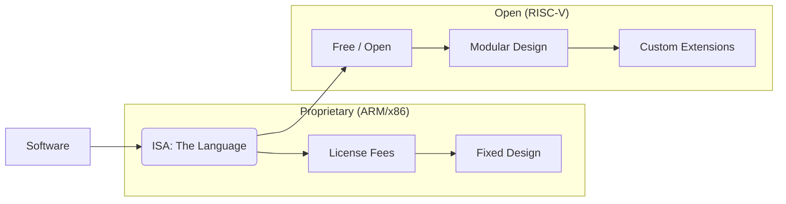

In the world of software, "Open Source" won a long time ago. Linux runs the world's servers, Android runs most phones, and nearly every tool we use is built on open-source libraries.

But in the world of **hardware**, we are still living in the "walled garden" era.

If you want to build a chip today, you usually have to pay a massive licensing fee to ARM (if you’re building for mobile) or Intel/AMD (if you’re building for desktop). You don't "own" the architecture; you’re just renting it.

But **RISC-V** is changing that forever.


## What is RISC-V?

RISC-V (pronounced "risk-five") is an open-standard **Instruction Set Architecture (ISA)**.

An ISA is the "language" that software speaks to hardware. It defines the basic commands like `ADD`, `STORE`, and `JUMP`. Historically, these languages were proprietary secrets.

RISC-V is different: it’s free, it’s open, and it’s managed by a non-profit foundation. Anyone can design a chip using RISC-V without paying a cent in royalties.

## Why This is a Revolution

### 1. Customization (The "Lego" Factor)
Proprietary ISAs are "take it or leave it." You get the whole package, even the parts you don't need. RISC-V is modular. You can take the "Base" instructions and then add custom "Extensions" for specific tasks like AI acceleration, cryptography, or signal processing.

### 2. Sovereignty and Security
Because the ISA is open, any country or company can build its own chips without worrying about being "cut off" by a foreign entity. It also allows for much deeper security auditing. You can’t hide a "backdoor" in an architecture that everyone can inspect.

### 3. Innovation at the Edge
Because the barrier to entry (the cost) has dropped to zero, we are seeing a "Cambrian Explosion" of weird, specialized chips. From tiny sensors that run on a grape-sized battery to massive AI supercomputers, RISC-V is everywhere.



## The "Linux Moment" for Hardware

Remember when people said Linux was just a "toy" and would never beat Windows? That’s where RISC-V was five years ago.

Today:
- **NASA** is using RISC-V for its next generation of spaceflight computers.
- **Meta** and **Google** are using RISC-V for their custom AI and data center silicon.
- **Milk-V** and **Pine64** are selling RISC-V single-board computers that you can buy for $50.

We are currently in the "Early Adopter" phase. The software ecosystem is still being built—you can’t just install Windows on a RISC-V chip yet (though Linux runs great). But the momentum is undeniable.

## The Future: Open Silicon for Everyone

The end goal of the RISC-V movement is a world where hardware is as accessible as software. A world where a student in a dorm room can design a custom processor, send the files to a fab, and have a working chip a few weeks later.

The walls are coming down. The era of the "proprietary gatekeeper" for silicon is coming to an end.

```text
> fetch risc-v
> building future...
> [####################] 100%
> SUCCESS: Hardware is now Open.
```

---

## References

- [RISC-V International Official Site](https://riscv.org/)
- [Milk-V: Open Source Hardware](https://milkv.io/)
- [MIT Technology Review: The open-source chip design that’s changing everything](https://archive.org/)
- [Pine64: Star64 (RISC-V SBC)](https://archive.org/)
