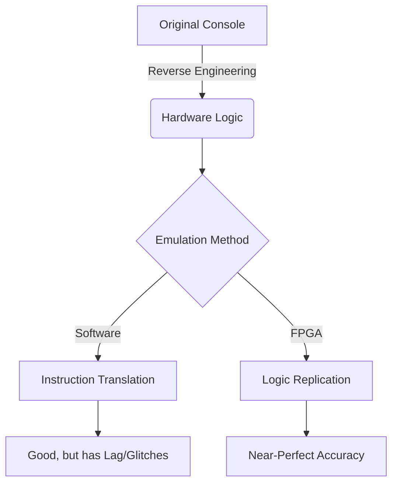

Most people think of emulation as a way to play *Super Mario* on their phone. And sure, it’s great for that.

But emulation is much more than a hobby. It is a critical, high-stakes battle to preserve the history of human creativity. According to a 2023 study by the Video Game History Foundation, **87% of classic video games released in the United States are critically endangered.**

If we don't emulate, we lose them forever.

## The Digital Rot

Unlike a book, which can sit on a shelf for 500 years and still be readable, digital media is fragile.

- **Bit Rot:** The magnetic data on floppy disks and the organic dye in CDs eventually break down.
- **Hardware Failure:** Capacitors leak, traces corrode, and power supplies explode. Every original Game Boy or NES is on a countdown timer to failure.
- **Copyright Limbo:** Games are often owned by companies that no longer exist, making them "orphaned" and legally impossible to purchase or preserve.

Emulation is the only way to "port" these experiences to modern hardware so they can survive.

## Software vs. Hardware Emulation (The MiSTer Revolution)

For years, we relied on **Software Emulation**. This is where a program (like Dolphin or RetroArch) tries to "pretend" to be an old console by translating its instructions in real-time. It’s flexible, but it’s rarely 100% accurate. There are always tiny glitches in timing, sound, or input lag.

But recently, the **FPGA (Field-Programmable Gate Array)** has changed everything.

Instead of writing software to *imitate* a console, projects like the **MiSTer FPGA** use a special chip to *become* the console. They reconfigure the physical gates of the chip to match the original hardware logic.

It’s not "imitation"; it's "replication."

## The Ethics of the "ROM"

Emulation often gets a bad rap because it’s associated with piracy. And while it’s true that you can download ROMs of games you don't own, focusing on that misses the bigger picture.

When a game is no longer for sale—when the company that made it is gone and the hardware to play it has turned to dust—**downloading that game is an act of preservation.**

If it weren't for "pirates" and hobbyist emulators, thousands of games from the 80s and 90s would simply not exist anymore. We wouldn't have the data to study them, enjoy them, or understand the evolution of game design.

## Why Accuracy Matters

You might ask, "Does it really matter if the sound of the jump in *Metroid* is 2% off pitch?"

To a historian, **yes**.

If we preserved a painting but changed the colors slightly because it was "easier," we wouldn't be preserving the art; we’d be preserving a copy. Perfect emulation ensures that we are experiencing the work exactly as the creators intended, with all its quirks and limitations intact.

## The Future: The Digital Library

We need to start treating video games with the same respect we give to film and literature. That means:
- Supporting projects like the **Internet Archive** and the **Video Game History Foundation**.
- Pushing for "Right to Repair" and "Right to Preserve" laws.
- Recognizing that "Emulation" is a noble technical pursuit, not a crime.

The games of our childhood are the myths and legends of the digital age. Let’s make sure they’re still playable a hundred years from now.

---

## References

- [Video Game History Foundation: 87% of Classic Games are Endangered](https://gamehistory.org/87-percent/)
- [MiSTer FPGA Wiki](https://mister-devel.github.io/Wiki_MiSTer/)
- [The Internet Archive: Console Living Room](https://archive.org/details/consolelivingroom)
- [Byuu (Near): The Importance of Cycle-Accurate Emulation](https://near.sh/articles/emulation/accuracy)
