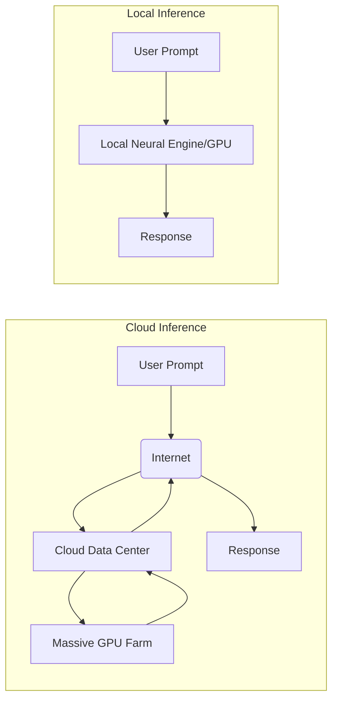

For the last couple of years, "AI" has been synonymous with "Cloud." Whether it's ChatGPT, Claude, or Gemini, the experience is the same: you type a prompt, it travels across the Atlantic to a massive data center, a thousand GPUs chew on it, and the response travels back to you.

It's impressive. It's also fragile.

If your internet goes down, your AI goes down. If the provider decides to hike prices or change their privacy policy, you're stuck. But a quiet revolution has been brewing in the open-source world, and it’s finally reaching the mainstream: **The Local LLM.**

## The Cloud Dependency Problem

Relying on cloud AI is like renting your brain. It's convenient, but you don't own it.

- **Privacy:** Every prompt you send to a cloud provider is stored, analyzed, and often used for future training. For personal notes or sensitive work, this is a non-starter.
- **Latency:** Even with fiber internet, there is a perceptible delay as data travels to the server and back.
- **Reliability:** When OpenAI has an outage, the world's productivity (arguably) takes a hit.
- **Cost:** $20/month adds up. For many users, a one-time investment in hardware is a much better deal.

## Enter the Local Model

Thanks to Meta's release of the **Llama** series and the incredible efficiency of models like **Mistral**, the gap between "Pro" cloud models and "Local" models is shrinking fast. We are now at a point where a mid-range consumer laptop can run an AI capable of coding, writing, and reasoning at a level that rivals GPT-3.5 or even GPT-4.

## Tools of the Trade

You don't need a PhD in Machine Learning to run these models anymore. The tooling has become incredibly polished:

1.  **Ollama:** The "Docker of LLMs." It’s a simple command-line tool that lets you download and run models with a single command: `ollama run llama3`.
2.  **LM Studio:** A beautiful, cross-platform GUI that lets you search for models on Hugging Face and run them with a "Play" button.
3.  **Jan.ai:** An open-source alternative that turns your local LLM into a ChatGPT-like interface, complete with a local API server.

## Hardware: The Apple Silicon Advantage

If you're wondering why everyone in the AI space is suddenly buying MacBooks, it's not just for the stickers. Apple's **Unified Memory Architecture** is a game-changer for local AI.

Unlike traditional PCs where the CPU and GPU have separate memory pools, Apple Silicon allows the GPU to access the entire system RAM. Since LLMs are "memory-hungry" (a 70B parameter model needs about 40GB of VRAM to run comfortably), being able to use 64GB or 128GB of unified RAM on a MacBook Pro makes it the most cost-effective AI workstation on the market.

## The Future is Hybrid

We aren't going to ditch the cloud entirely. For massive tasks like training or massive multi-modal reasoning, the cloud will still reign supreme. But for our daily workflows—summarizing emails, drafting code, and organizing our thoughts—the future is local.

It’s about **Digital Sovereignty**. It’s about knowing that the "intelligence" you rely on is yours, it’s private, and it works even when the world goes offline.

---

## References

- [Ollama - Get up and running with large language models.](https://ollama.com/)
- [Hugging Face - The AI community building the future.](https://huggingface.co/)
- [Mistral AI - Frontier AI in your hands.](https://mistral.ai/)
- [Llama 3 - Meta's most capable open-source model.](https://llama.meta.com/llama3/)
