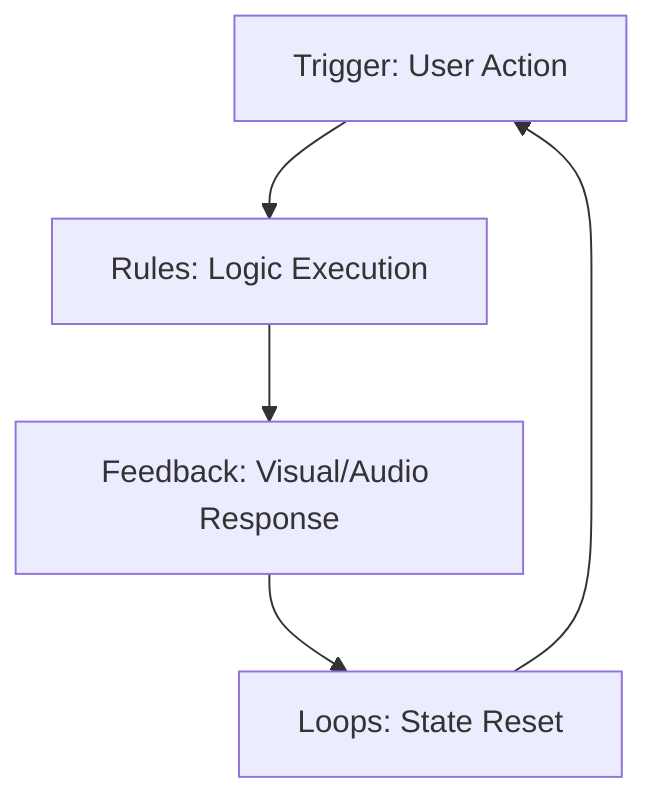

Have you ever pushed a physical button—maybe a high-end light switch or the ignition on a classic car—and felt that satisfying *click*? It’s more than just a mechanical necessity. It’s a confirmation. It’s a conversation between you and the machine. It says, "I heard you, and I’m on it."

In the digital world, we often lose that tactile connection. We click a button on a screen and wait, staring at a static cursor, wondering if the server received our request or if the browser just gave up on life.

This is where **micro-interactions** come in. They are the "small moments" of a product that perform a single task while providing feedback and delight. And in 2026, they are what separate "usable" software from "lovable" software.

## The Soul of the Machine

Micro-interactions aren't just "eye candy." According to Dan Saffer, the guy who literally wrote the book on the subject, a micro-interaction has four parts:

1.  **The Trigger:** What initiates the interaction (e.g., clicking a "Copy" button).
2.  **The Rules:** What happens during the interaction (e.g., the text is sent to the clipboard).
3.  **The Feedback:** How the user knows what happened (e.g., the button text changes to "Copied!").
4.  **Loops & Modes:** What happens over time (e.g., the button reverts to "Copy" after two seconds).

When these four pieces work together, they create a sense of **Digital Sovereignty**. You feel in control because the interface is responding to you in real-time.

## Why We Crave Them

Think about the "Pull to Refresh" gesture on your phone. It’s not just a way to update your feed; it’s a tactile experience. The way the list stretches, the haptic vibration, the little spinner that pops up—it’s satisfying. It turns a mundane task into a tiny moment of play.

On this very blog, I’ve been experimenting with these small moments:

-   **The Copy Button:** When you hover over a code block, a button appears. When you click it, it changes color and text. It’s a tiny "thank you" for interacting with the content.
-   **The Theme Toggle:** Instead of an abrupt snap, the colors transition smoothly. It’s a gentle shift from day to night.
-   **The Back to Top Button:** It doesn't just sit there; it waits until you've scrolled deep enough to need it, then slides into view like a helpful assistant.

## The "Luxury Car" Effect

There’s an old story about luxury car manufacturers spending millions of dollars just to tune the sound of the door closing. They want it to be a solid, reassuring *thud*, not a tinny *clank*. That thud communicates quality, safety, and engineering excellence.

Your software’s micro-interactions are your "thud."

If your hover states are snappy, your transitions are buttery, and your feedback is immediate, you are telling the user: "We cared enough to sweat the small stuff. If we cared this much about a button, imagine how much we cared about the core logic."

## Starting Small

You don't need a massive budget or a team of motion designers to add delight. Start with the basics:

-   **Active States:** Make sure buttons look "pushed" when clicked.
-   **Empty States:** Don't just show a blank screen; show a friendly illustration or a helpful tip.
-   **Loading States:** Use skeletons or progress bars instead of generic spinners.

In the end, the architecture of delight isn't about complexity. It’s about empathy. It’s about remembering that on the other side of the screen is a human being who just wants to feel a little bit more connected to the tools they use every day.

---

## Further Reading

-   *Microinteractions: Designing with Details* by Dan Saffer.
-   [The Role of Micro-interactions in UX Design](https://www.nngroup.com/articles/microinteractions/) - Nielsen Norman Group.
-   [Animation for Attention and Feedback](https://web.dev/articles/animations-guide) - web.dev.
