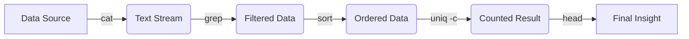

If you walk into a high-end furniture showroom, everything is perfect. The lighting is soft, the chairs are arranged just so, and there’s a distinct lack of sawdust. It’s designed for one thing: **consumption**. You see a finished product, you like it, you take it home.

Modern operating systems—Windows, macOS, even most Linux desktops—are digital showrooms. They are beautiful, intuitive, and remarkably polished. They present you with a set of pre-defined actions (buttons) that lead to pre-defined outcomes.

But if you want to actually *build* the chair? You don’t go to the showroom. You go to the workshop. And in the world of computing, the workshop is the **Terminal**.

## The Beautiful Mess

The first time you open a terminal, it feels like walking into a dimly lit garage filled with sharp tools and heavy machinery. There are no friendly labels telling you what to do. There’s just a blinking cursor—a silent, expectant prompt.

`$`

It’s intimidating because it’s a blank slate. In a GUI, the interface tells you what is possible. In the terminal, you have to know what is possible. But that shift from "tell me" to "I'll tell you" is where the magic happens.

## The Power of Composition

The greatest strength of the terminal isn't any single command like `ls` or `grep`. It’s the **pipe** (`|`).

In a showroom, if you want a blue chair with red legs, you have to hope the manufacturer made one. In a workshop, you take a chair, you take some paint, and you make it yourself.

The terminal treats every program as a modular tool. You can take the output of one tool and feed it directly into another. This "Unix Philosophy"—write programs that do one thing and do it well, and work together—is what makes the command line so resilient.

## Why We Still Use It in 2026

You might think that by 2026, with AI-driven interfaces and hyper-intelligent IDEs, the terminal would be a relic of the past. But it’s actually more relevant than ever.

1.  **Automation is Sovereignty:** If you can do it in the terminal, you can script it. If you can script it, you own it. You aren't beholden to a developer adding a "batch process" button to their app.
2.  **Latency of Thought:** For an expert, typing `git commit -m "fix"` is faster than moving a mouse, clicking a menu, finding a field, and clicking "OK". The terminal operates at the speed of thought.
3.  **The Universal Language:** Whether you're on a Raspberry Pi, a massive cloud server, or a Steam Deck, the shell is the same. It’s the lingua franca of the machine.

## The Showroom is for Users, the Workshop is for Makers

There is nothing wrong with the showroom. I love a good GUI for browsing photos or editing video. But when it comes to the core logic of my digital life—managing files, deploying code, or even just processing text—I want to be in the workshop.

I want the sawdust. I want the sharp tools. I want the blinking cursor that says, "What are we building today?"

So, if you’ve been sticking to the showroom, try opening the garage door. It’s a bit messy, and you might stub your toe on a `syntax error`, but once you learn how to use the tools, you’ll never want to leave.

---

## My Favorite Tools

If you're looking to upgrade your workshop, here are a few tools that have become indispensable to me:

-   **fzf:** A command-line fuzzy finder. It’s like a search engine for your terminal history and files.
-   **ripgrep (rg):** The fastest way to find text in files.
-   **bat:** A `cat` clone with wings (syntax highlighting and git integration).
-   **tmux:** A terminal multiplexer that lets you manage multiple sessions in one window.

Happy hacking!
