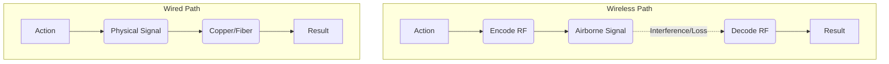

It’s 2026. My coffee maker has Wi-Fi. My lightbulbs have Wi-Fi. My toothbrush has Bluetooth. If I stand in the center of my apartment and close my eyes, I can almost feel the 2.4GHz and 5GHz waves vibrating through my soul (or maybe that’s just the third espresso).

We were promised a wireless utopia. No more "cable spaghetti," no more "being tethered," just pure, unadulterated digital freedom. And for a while, it was glorious. But lately, I’ve been doing something radical. I’ve been going back to the wire.

## The Invisible Traffic Jam

The problem with wireless isn't the technology; it's the neighbors. In 2026, the airwaves are crowded. Everyone has a mesh system pumping out massive amounts of data. Even with Wi-Fi 7 and the shiny new 6GHz bands, the "noise" is real.

I noticed it first in my mouse. Just a tiny, infinitesimal stutter when I moved it across the screen. Most people wouldn't notice, but if you spend twelve hours a day looking at a cursor, you feel it in your bones. It’s like a tiny itch you can’t scratch.

I plugged it in.

The itch went away. The cursor became an extension of my hand again. Zero latency. Zero interference. Just pure, copper-bound intentionality.

## The Simplicity of the Path

When you use wireless, your data has to go through a complex dance of encoding, transmission, reception, and decoding. It’s a miracle it works at all. When you use a wire, it’s just electrons moving down a path.

The wired path is shorter, simpler, and—most importantly—predictable. In the world of software engineering, "predictable" is another word for "sanity."

## Maintenance vs. Performance

I’m tired of charging things.

There is a specific kind of modern anxiety that comes from your keyboard dying in the middle of a focus block. You have to find the cable, plug it in, wait for it to wake up... the flow is gone.

A wired keyboard never asks for anything. It doesn't need a firmware update to "improve battery life." It doesn't need to be paired. It just *is*. It sits there, faithful and ready, powered by the very machine it serves. There’s a beautiful symbiosis in that.

## The Ethernet Epiphany

Last week, I finally ran a CAT6a cable from my router to my desk. I’d been relying on a "high-speed" wireless bridge for years. The speed tests were fine—great, even. But the *stability*? That’s where the wire shines.

When I’m in a video call, I don't get that "Your connection is unstable" warning. When I pull a massive Docker image, it doesn't fluctuate; it just saturates the line and finishes. It’s the difference between a garden hose that sometimes kinks and a steady, reliable stream.

## A Form of Digital Mindfulness

Going back to wires feels like a deliberate choice. It’s an admission that "convenience" isn't always the highest good. Sometimes, the "inconvenience" of a cable is actually a feature. It defines a space. My desk is where the wires are. It’s my workshop (as I wrote [yesterday]()). When I’m tethered, I’m focused.

So, if you’re feeling that strange, modern malaise—the stuttering cursor, the dropped packets, the low-battery pings—try a cable. It might feel like stepping back in time, but once you feel that rock-solid connection, you might never want to cut the cord again.

Stay grounded. Stay wired.

---

## My Wired Essentials

- **The Keyboard:** A Leopold FC660C (Topre switches, permanently tethered).
- **The Mouse:** A modified Logitech G Pro with a lightweight paracord cable.
- **The Audio:** A pair of Sennheiser HD600s plugged into a dedicated DAC/Amp. No codecs, no lag, just sound.
- **The Network:** CAT6a everything. If it has an RJ45 port, it’s plugged in.

Happy (physical) connecting!
