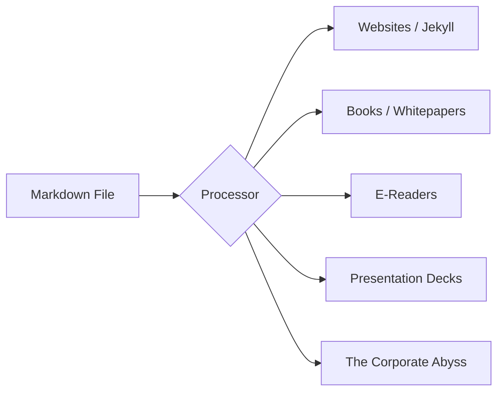

It’s 2026. We have VR headsets that track our thoughts, AI that can write entire codebases (well, almost), and "No-Code" platforms that promise to build apps by snapping fingers. And yet, here I am, typing into a plain text file using a syntax invented in 2004 by a guy with a penchant for high-quality apple hardware and well-structured sentences.

Markdown is 22 years old. In "tech years," that’s roughly equivalent to being a trilobite. So why, in an era of hyper-dynamic, database-driven editors, does Markdown feel more relevant than ever?

## The Tragedy of the Black Box

We’ve all been there. You find an old document from five or ten years ago—maybe it’s a `.doc`, a `.pages`, or some proprietary format from an app that went bankrupt in the great "SaaS Purge of 2024." You try to open it, and you’re met with a wall of gibberish, a "Corrupt File" warning, or a demand for a $19.99/month subscription just to *view* your own thoughts.

This is the tragedy of the "Black Box" format. Your data is held hostage by the software that created it.

Markdown is the antidote. It’s just text. Even if every Markdown editor on the planet disappeared tomorrow, you could open your files in `Notepad`, `TextEdit`, or even `cat` them in the [terminal]() and still read every single word.

## Separation of Concerns (For Your Brain)

One of the biggest traps in modern writing is "fiddling." You start writing a paragraph, and suddenly you’re spending twenty minutes picking the perfect font, adjusting the line spacing, and wondering if the header should be #333333 or #343434.

Markdown forces a "Separation of Concerns." You focus on the **structure** and the **content**. The **presentation** is someone else’s problem (specifically, the CSS’s problem).

-   `#` means a header.
-   `**` means emphasis.
-   `[link]` means a connection.

That’s it. By limiting your choices, Markdown frees your mind to actually *write*.

## The Ultimate Pipeline

Because Markdown is just text, it can be transformed into anything. It’s the universal donor of the digital world.

This blog is built on Markdown. My [Local-First]() notes are Markdown. My READMEs are Markdown. It’s the glue that holds my digital life together.

## Bet on the Long Tail

In 2026, we are surrounded by "ephemeral tech." Apps come and go. Platforms pivot. Terms of service change.

If you want your writing to last—if you want to be able to read your journals, your notes, and your blog posts in 2046—you have to bet on formats that are platform-agnostic. You have to bet on the "Long Tail" of plain text.

Markdown isn't just a syntax; it’s a commitment to **Digital Sovereignty**. It’s the realization that your words belong to you, not the app you typed them into.

So, the next time you’re tempted by a shiny new "AI-powered, block-based workspace," ask yourself: "Can I read this file with a simple script 20 years from now?" If the answer is no, stick to the `#`.

Stay readable. Stay forever.

---

## My Markdown Toolkit

If you're ready to embrace the text-only lifestyle, here are my current favorites:

-   **Obsidian:** The powerhouse for local-first knowledge management.
-   **MarkText:** A beautiful, open-source real-time preview editor.
-   **Pandoc:** The "Swiss-army knife" for converting Markdown to anything else.
-   **iA Writer:** For when you just want to see the words and nothing else.

Happy writing!
