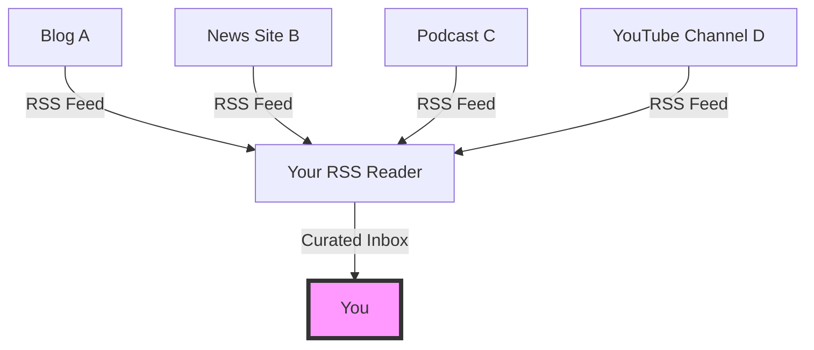

It’s 2026, and we are all exhausted.

We spend our days being "fed" by algorithms. Whether it’s your social media timeline, your news aggregator, or even your email inbox, there is a silent, opaque piece of code deciding what you should see, in what order, and how often. It’s designed to maximize "time on site," not "quality of life."

But there is a quiet rebellion happening. People are dusting off a protocol that most tech pundits declared dead a decade ago: **RSS (Really Simple Syndication).**

## The Algorithm is Not Your Friend

The "Algorithm" is like a buffet where the chef keeps sliding mystery meat onto your plate based on what he *thinks* you liked yesterday. You have no control, no transparency, and you’re constantly being nudged toward the most inflammatory or "viral" content.

RSS is the opposite. It’s a subscription. You find a blog you like (like this one!), you copy the RSS link into your reader, and that’s it. When the author publishes something, it shows up. No more, no less. It’s a chronological, clean, and intentional way to consume information.

## The Architecture of Intent

In an era of [Small Web]() and [Local-First]() software, RSS fits perfectly. It’s a pull-based system, not a push-based one.

With RSS, you are the curator. You are the editor-in-chief of your own personal newspaper.

## Why RSS is Winning in 2026

You might ask: "Why now?" Why is a technology from 1999 suddenly cool again?

### 1. No Ads, No Tracking
RSS readers generally strip away the bloat. You get the text, the images, and the links. You don't get the ten tracking pixels, the auto-playing video ads, or the "One Weird Trick" clickbait at the bottom of the page. It’s a [Forever Format]() for consumption.

### 2. Mental Clarity
When you use an RSS reader, you reach the "End of the Feed." Once you’ve read the updates from the people you follow, you’re done. There is no "Infinite Scroll" designed to keep you trapped in a dopamine loop. It respects your time.

### 3. Bypassing the Gatekeepers
We’ve seen what happens when platforms decide to "pivot" or change their algorithms. Content creators lose their reach, and readers lose their favorite voices. RSS is a direct line. As long as the site exists, the feed exists.

## The RSS Renaissance Toolkit

If you’re ready to reclaim your attention, here’s how to get started in 2026:

- **NetNewsWire (macOS/iOS):** Still the gold standard for clean, fast, and native RSS reading.
- **FreshRSS:** For the self-hosters who want a powerful web-based reader they control.
- **Inoreader:** For the power users who want advanced filtering and automation.
- **Readwise Reader:** A modern take that combines RSS, newsletters, and "read-it-later" into one beautiful app.

## The Takeaway

The "Big Web" wants you to be a passive consumer. RSS allows you to be an active participant. It’s a small, technical choice that has a massive impact on your digital well-being.

So, the next time you find a website that makes you think, don't look for the "Follow" button on social media. Look for that little orange icon.

Stay curious. Stay in control.

