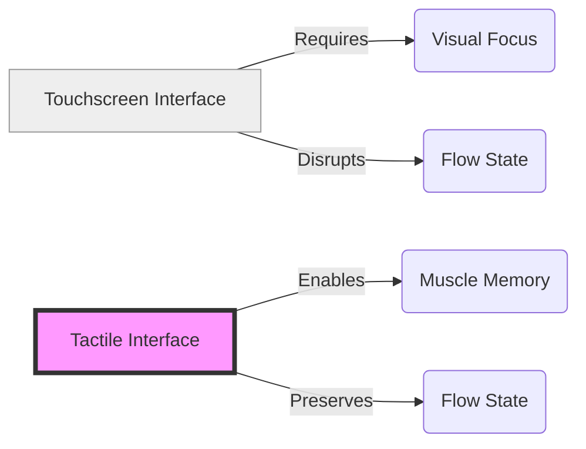

It’s 2026, and we’ve finally reached "Peak Glass."

For the better part of the last decade, we were sold a dream of the "infinite interface." A single, smooth slab of glass that could be anything: a calculator, a map, a volume slider, a climate control panel. It was sleek, it was futuristic, and—as we’ve eventually realized—it was a bit of a nightmare to actually use.

We’ve spent too many years staring at screens just to adjust the temperature in our cars or skip a track on a playlist. But the tide is turning. The "Tactile Renaissance" is here, and it’s clicky, knurled, and wonderfully physical.

## The Cognitive Tax of the Touchscreen

The fundamental flaw of the touchscreen is that it requires your eyes. You cannot "feel" where a virtual button is. You have to look away from the road, or your conversation, or your work, to ensure your finger is hovering over the right set of pixels. In an era where we are already struggling with [Algorithm fatigue](), the last thing we need is our thermostat demanding visual attention.

In the early 2020s, this was seen as "clean" design. In 2026, we call it what it is: a cognitive tax.

When you have a physical knob—like the beautifully weighted aluminum ones making a comeback in modern EV dashboards—your brain builds a spatial map. You know exactly where the volume is. You can feel the detents as you turn it. You get instant, haptic feedback that doesn't require a single millisecond of visual attention. It’s the difference between trying to play a piano on an iPad vs. a real Steinway. One is an emulation; the other is an extension of your body.

## The Return of the Knob

Why is this happening now? Because we’ve realized that [Local-First]() isn't just about software; it's about the interface between our bodies and our machines. We want our interactions to be "quiet," much like the [Quiet Protocols]() we’ve discussed before.

We are seeing a massive shift in industrial design across the board:

- **The "Safety First" Dashboard:** Car manufacturers are finally ditching the "tablet glued to the dash" look. The 2026 models from major brands are touting "Safety Knobs" as a premium feature, moving critical functions back to physical hardware where they belong.
- **The Dedicated Audio Gear:** Vinyl sales didn't just survive; they triggered a boom in dedicated hi-fi equipment where every toggle switch feels like it belongs in a NASA control room. We want to *feel* the music, and that starts with the gear.
- **The Smart Home Switch:** We’ve stopped trying to talk to our light bulbs or open apps to dim the kitchen. We want a switch that we can slap on the way out the door—a simple, reliable, physical action.

## Designing for the Hand, Not the Eye

Designing for tactile feedback is significantly harder than designing for a screen. You can't just push a software update to change the "feel" of a mechanical switch. It requires a deeper level of craftsmanship—the kind of intentionality we talked about in [The Architecture of Delight]().

It reminds me of why we still love the [Terminal](). It's about precision. When you click a well-made mechanical switch, you aren't just sending a signal to a microcontroller. You are engaging with a physical system. There is a weight, a resistance, and a release. It’s a micro-moment of satisfaction that no haptic motor can truly replicate.

## The Takeaway

In 2026, luxury isn't a bigger screen. In fact, the most expensive devices are increasingly the ones with the *fewest* screens. Luxury is a device that respects your attention. It’s a device that you can operate with your eyes closed because it was designed with your hands in mind.

We spent fifteen years trying to turn the world into a smartphone. Now, we’re finally remembering that the world is three-dimensional, and so are we.

So, here’s to the button. Here’s to the knob. Here’s to the satisfying *click* that tells you exactly what happened, without needing a single pixel to explain it.

Stay curious. Stay tactile.

- [Why your keyboard layout still matters]()
