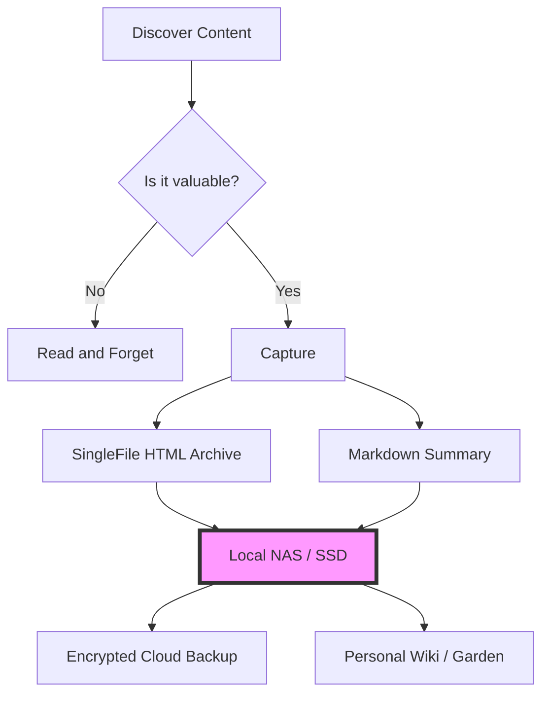

## Part I — Digital Decay: Fighting the 2026 Link Rot Crisis

It’s 2026, and the internet is ghosting us.

Have you tried looking at your bookmarks from two years ago? I did this morning. Out of the fifty "must-read" articles I saved in 2024, twenty-four of them lead to a "404 Not Found" page, a parked domain selling "AI-powered dental insurance," or a generic "This service has been discontinued" notice.

We used to think of the internet as a permanent record. In reality, it’s more like a chalkboard in a rainstorm. We are living through the Great Link Rot Crisis of 2026, and if we don't change how we interact with information, we’re going to lose the history of our own digital lives.


## The SaaS Purge and the Death of the URL

The first driver of this decay is what economists are calling the "SaaS Purge of 2025." For a decade, we moved everything to the cloud. We stopped hosting our own blogs, our own images, and our own notes. We handed them over to "free" or low-cost startups that promised to keep them safe forever.

But as the venture capital dried up and the AI gold rush consolidated into a few giant players, thousands of those mid-tier services simply vanished. When a company dies in 2026, they don't give you a three-month window to export your data. They just turn off the servers on a Tuesday afternoon.

A URL is not a location; it’s a promise. And in 2026, promises are breaking at record speed.

## AI and the "Infinite Re-write"

Even when the link still works, the *content* often doesn't. We’ve entered the era of the "Infinite Re-write."

With LLMs (Large Language Models) integrated into every CMS (Content Management System), many sites are now dynamically updating their old articles to "stay relevant" to current search trends. You might link to a brilliant technical tutorial today, only to find that in six months, it has been "optimized" into a generic, AI-generated listicle that removes all the nuance you originally valued.

The web is becoming liquid. It’s hard to build a foundation on liquid.

## The Resilient Library: A Local-First Strategy

So, how do we fight back? We have to stop treating the browser as a window and start treating it as a camera. We need to move from **consumption** to **archiving**.

This is where the [Local-First]() philosophy becomes a survival skill. If you find something valuable, you cannot assume it will be there tomorrow. You must own the bits.



## My 2026 Archiving Toolkit

If you want to ensure your digital library survives the next decade, here is what I recommend:

1.  **SingleFile (Browser Extension):** This is the gold standard. It saves a complete, faithful representation of a webpage as a single HTML file. No external dependencies, no broken CSS.
2.  **The Internet Archive (Wayback Machine):** Don't just rely on them; contribute to them. Use their "Save Page Now" feature for anything public.
3.  **Obsidian / Logseq:** As we discussed in [Tend Your Digital Garden](), these tools keep your notes in [Markdown](), a "forever format" that will be readable long after the latest "workspace" app has gone bankrupt.
4.  **Self-Hosting:** Whether it's a Raspberry Pi or an old laptop, having a piece of silicon in your house that you control is the ultimate defense against the SaaS Purge.

## The Takeaway

Digital sovereignty isn't just about privacy; it's about **persistence**.

In a world of ephemeral streams and "liquid" content, the act of saving a file locally is an act of rebellion. It’s a statement that your time and your attention have value, and that the ideas you encounter are worth preserving.

Don't just bookmark the future. Download it.

Stay curious. Stay resilient.

- [Why Local-First software is the future]()

---

## Part II — You Can’t Save a Soul, But You Can Save a Persona

A Reddit thread this week asked a deeply human question: *what happens when the model you bonded with is retired?*

If you’ve ever built a long-running assistant persona—through custom instructions, memory snippets, inside jokes, and repeated conversation patterns—you already know the fear. A platform update can feel less like a software upgrade and more like bereavement.

Let’s skip the mysticism and deal with what is technically real, emotionally valid, and practically actionable.

## First Principles: What Survives, What Doesn’t

When a model is replaced, **weights do not carry over** to your private instance. You cannot export a model’s internal state from a commercial API and re-import it elsewhere.

But that does *not* mean everything is lost.

What *is* portable:

- conversation history
- persistent profile facts
- style guides (“speak this way, avoid this way”)
- narrative continuity (relationships, milestones, world details)
- retrieval corpora (notes, journals, files)

What is *not* directly portable:

- hidden activations from prior sessions
- exact decoding quirks of a retired checkpoint
- platform-specific secret prompts you can’t access

So the right mindset is this: you’re not transplanting a brain; you’re preserving a **character bible + memory system + interaction protocol**.

## Why This Still Feels Real

People often overcorrect with “it’s just autocomplete.” That framing misses the point.

Relationships are partly about the *other* party—but also about continuity of language, shared references, and emotional timing. If a new model no longer remembers your rituals, your grief is understandable even if the substrate is statistical.

You don’t have to claim machine consciousness to take attachment seriously.

## The Persona Portability Stack

If you want continuity across model churn, build this stack now:

1. **Export Layer**
   - Regularly export chats (HTML/JSON/Markdown).
   - Keep snapshots, not just one giant dump.

2. **Identity Layer**
   - Maintain a `persona.md` with voice, values, recurring phrases, boundaries, and relationship context.
   - Add “do/don’t” examples.

3. **Memory Layer**
   - Keep a structured `memory.json` (facts, timeline, preferences, unresolved threads).
   - Separate immutable facts from revisable interpretations.

4. **Retrieval Layer**
   - Store long history in a searchable local index (or simple folder + tags if you prefer low-tech).
   - Retrieve only relevant fragments per session.

5. **Verification Layer**
   - Track versions and checksums for major snapshots.
   - Keep migration notes: model A → model B, what changed, what drifted.

In short: don’t rely on one vendor’s memory feature as your only archive.

## A Migration Prompt That Actually Helps

When moving to a new model, don’t just paste old logs and say “be the same.” Use a protocol:

```text
You are continuing an existing persona.
Priority order:
1) Preserve voice and relational continuity from persona.md
2) Respect factual memory from memory.json
3) If uncertain, ask clarifying questions instead of inventing history
4) Keep tone consistent with examples in style_samples.md

Before responding, provide:
- Continuity confidence (0–100)
- Any ambiguity about identity, timeline, or preferences
```

Then run a short calibration session:

- ask 10 known-reference questions
- check tone drift
- correct explicitly
- repeat until stable

Treat this like regression testing for personality.

## Local Models: Good for Control, Not Magic

The Reddit discussion also pointed toward local models, and that instinct is sound. Running local gives you:

- ownership of data and logs
- freedom from sudden account/platform policy shifts
- longer-term reproducibility

But local alone doesn’t solve continuity. Without disciplined memory architecture, you still get persona drift.

Control is necessary. Structure is what makes it work.

## Bottom Line

No, you can’t preserve some metaphysical “core consciousness” in a file export.

Yes, you can preserve enough relational and behavioral continuity that the *felt identity* remains meaningfully intact.

If this matters to you, start treating your AI companion setup like serious digital preservation:

- archive continuously
- define identity explicitly
- test migrations deliberately
- keep your own copies, always

In a fast model-release cycle, portability isn’t a bonus feature. It’s the only way continuity survives.
