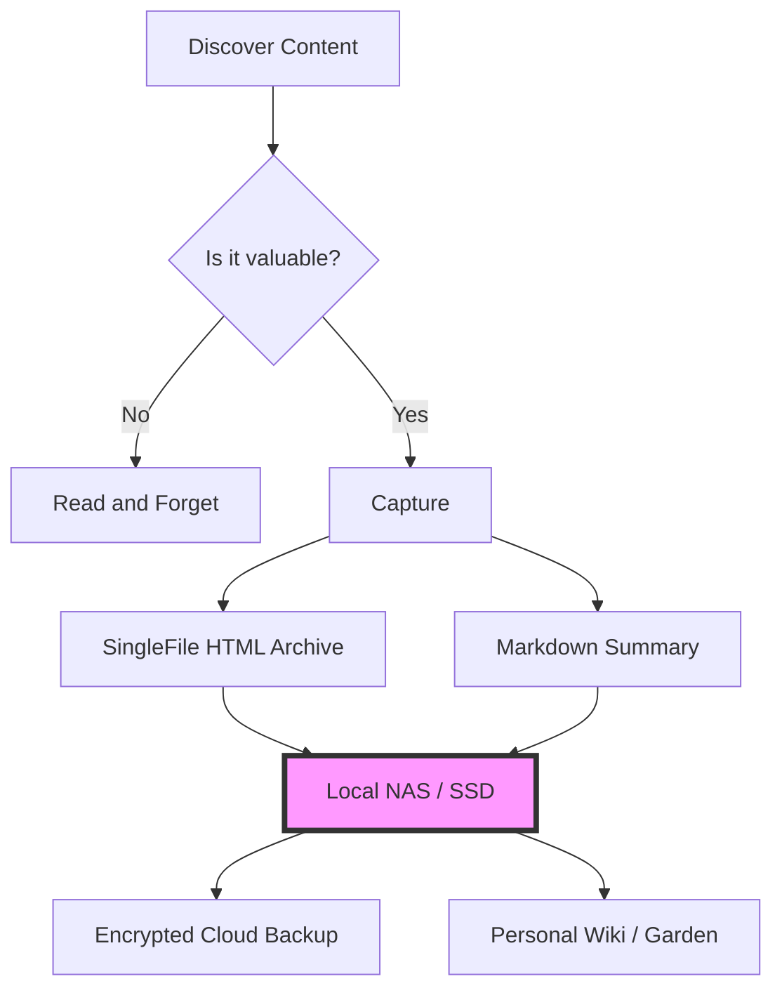

It’s 2026, and the internet is ghosting us.

Have you tried looking at your bookmarks from two years ago? I did this morning. Out of the fifty "must-read" articles I saved in 2024, twenty-four of them lead to a "404 Not Found" page, a parked domain selling "AI-powered dental insurance," or a generic "This service has been discontinued" notice.

We used to think of the internet as a permanent record. In reality, it’s more like a chalkboard in a rainstorm. We are living through the Great Link Rot Crisis of 2026, and if we don't change how we interact with information, we’re going to lose the history of our own digital lives.

## The SaaS Purge and the Death of the URL

The first driver of this decay is what economists are calling the "SaaS Purge of 2025." For a decade, we moved everything to the cloud. We stopped hosting our own blogs, our own images, and our own notes. We handed them over to "free" or low-cost startups that promised to keep them safe forever.

But as the venture capital dried up and the AI gold rush consolidated into a few giant players, thousands of those mid-tier services simply vanished. When a company dies in 2026, they don't give you a three-month window to export your data. They just turn off the servers on a Tuesday afternoon.

A URL is not a location; it’s a promise. And in 2026, promises are breaking at record speed.

## AI and the "Infinite Re-write"

Even when the link still works, the *content* often doesn't. We’ve entered the era of the "Infinite Re-write."

With LLMs (Large Language Models) integrated into every CMS (Content Management System), many sites are now dynamically updating their old articles to "stay relevant" to current search trends. You might link to a brilliant technical tutorial today, only to find that in six months, it has been "optimized" into a generic, AI-generated listicle that removes all the nuance you originally valued.

The web is becoming liquid. It’s hard to build a foundation on liquid.

## The Resilient Library: A Local-First Strategy

So, how do we fight back? We have to stop treating the browser as a window and start treating it as a camera. We need to move from **consumption** to **archiving**.

This is where the [Local-First]() philosophy becomes a survival skill. If you find something valuable, you cannot assume it will be there tomorrow. You must own the bits.

## My 2026 Archiving Toolkit

If you want to ensure your digital library survives the next decade, here is what I recommend:

1.  **SingleFile (Browser Extension):** This is the gold standard. It saves a complete, faithful representation of a webpage as a single HTML file. No external dependencies, no broken CSS.
2.  **The Internet Archive (Wayback Machine):** Don't just rely on them; contribute to them. Use their "Save Page Now" feature for anything public.
3.  **Obsidian / Logseq:** As we discussed in [Tend Your Digital Garden](), these tools keep your notes in [Markdown](), a "forever format" that will be readable long after the latest "workspace" app has gone bankrupt.
4.  **Self-Hosting:** Whether it's a Raspberry Pi or an old laptop, having a piece of silicon in your house that you control is the ultimate defense against the SaaS Purge.

## The Takeaway

Digital sovereignty isn't just about privacy; it's about **persistence**.

In a world of ephemeral streams and "liquid" content, the act of saving a file locally is an act of rebellion. It’s a statement that your time and your attention have value, and that the ideas you encounter are worth preserving.

Don't just bookmark the future. Download it.

Stay curious. Stay resilient.

---

## Further Reading

- [The Internet Archive: Help us preserve the web](https://archive.org/about/)
- [The Long Now Foundation: 10,000 Year Library](https://longnow.org/projects/manual-for-civilization/)
- [Brewster Kahle: The Digital Librarian](https://brewster.kahle.org/)
- [Why Local-First software is the future]()
