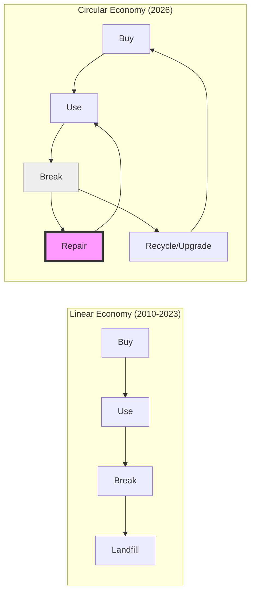

It’s 2026, and I just did something that would have voided my warranty, summoned a legal cease-and-desist, and probably bricked my device just four years ago.

I swapped out my phone's battery. In the park. With a T5 screwdriver and ten minutes of my time.

If you told 2021-me that this would be a mundane Friday afternoon activity, I would have laughed while staring at my $1,200 sealed-glass brick, wondering why the battery was glued to the screen like a tragic, permanent roommate.

But the "Era of the Sealed Box" is officially over. We’ve moved from the **Right to Repair** to the **Duty to Repair**, and it has changed everything about how we build and buy tech.

## The Great Un-Gluing

For a decade, we were sold a lie: that thinness was the only metric that mattered. To get those extra 0.5 millimeters of "sleekness," manufacturers traded away our ability to fix what we owned. Batteries were glued. RAM was soldered. Screens were fused to the chassis with proprietary adhesives that required a heat gun and the steady hands of a neurosurgeon to remove.

The turning point was the **European Repairability Mandate of 2024**, followed quickly by the **US Digital Fair Repair Act**. These weren't just suggestions; they were ultimatums. If you wanted to sell a device, it had to be "Opening-Ready."

Suddenly, the engineers who spent years figuring out how to hide screws were tasked with making them accessible.

## The "Repairability Score" is the New Flex

In 2021, we bragged about megapixel counts and nanometer processes. In 2026, the biggest flex is a **10/10 Repairability Score**.

When you buy a laptop today, you don't just look at the CPU speed. You look at the "Parts Availability" guarantee. Major brands now ship their flagship devices with a QR code laser-etched onto the internal shield. Scan it, and you get the official CAD files, the schematics, and a direct link to buy every single screw, gasket, and ribbon cable at cost.

## The Rise of the Modular Aesthetic

This shift hasn't just changed the internals; it’s changed the *vibe*.

We’ve embraced what I call "Modular Brutalism." Look at the **Framework Laptop** or the **Fairphone 6**. They aren't trying to hide the fact that they are machines. They have visible fasteners, textured grips for easy prying, and color-coded internal components.

It’s the hardware equivalent of the [Tactile Manifesto](). We want to *see* how the thing works. We want to know that if the charging port wears out—as all physical ports eventually do—we can swap it for $15 instead of buying a new motherboard for $600.

## From Consumers to Stewards

The most profound change, though, is psychological.

When your device is a sealed black box, you are just a "user." You are a guest in the manufacturer's ecosystem. When it breaks, you feel helpless. You feel like the victim of a system designed to extract more money from you.

But when you can open it, clean out the dust, and swap a failing fan, you become a **steward**. You own the device in a way that goes beyond the receipt. There’s a deep, primal satisfaction in maintenance. It’s the same feeling our grandparents had when they worked on their own cars.

## The Takeaway

In 2026, we’ve realized that sustainability isn't just about using recycled plastic in the packaging. It’s about **longevity**. The greenest device is the one that stays in your pocket for eight years because it’s easy to keep it running.

The "Sealed Era" was a fever dream of planned obsolescence. We’ve finally woken up, and we brought our screwdrivers with us.

Stay curious. Stay repairable.

---

## Further Reading

- [The iFixit 2026 Repairability Index](https://www.ifixit.com/repairability)
- [Framework: The future of modular computing](https://frame.work/)
- [The Right to Repair: A Global Movement](https://repair.org/)
- [Why we're bringing back the button]()
