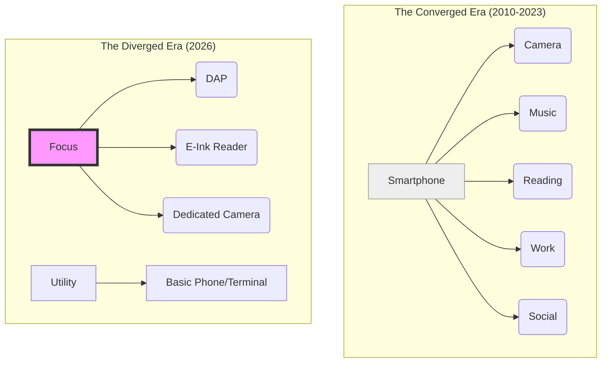

Remember 2015? The dream was the "Converged Device."

We were promised a future where your smartphone would be your wallet, your keys, your camera, your library, and your therapist. And for a while, we got it. We packed our entire lives into a six-inch slab of glass and aluminum, patted ourselves on the back for being so efficient, and then wondered why we were all so incredibly anxious and distracted all the time.

Well, it’s 2026, and the "Everything Machine" is starting to look like a "Nothing-in-Depth Machine."

The trend for this year isn't a faster processor or a thinner screen. It’s **Divergence**. We are intentionally breaking our digital lives back apart into dedicated, single-purpose tools that respect our boundaries.

## The "Swiss Army Knife" Fatigue

The problem with a Swiss Army Knife is that it’s a mediocre knife, a terrible pair of scissors, and a screwdriver that will definitely strip your screws if you look at it wrong. It’s great for emergencies, but you wouldn’t use it to build a house.

Our smartphones became our digital Swiss Army Knives. You open your Kindle app to read a few pages of a novel, but then—*ping*—a Slack notification from work. Then a TikTok link from your cousin. Then a reminder that your credit card bill is due.

By the time you get back to the book, your brain is a scrambled egg. You haven't read; you've just survived a gauntlet of context-switching.

In 2026, we’ve realized that **context-switching is the enemy of craft**.

## The Rise of the Singular Tool

This realization has birthed what the tech journals are calling the "Anti-Convergence Wave." People are carrying dedicated devices again, and they aren’t doing it for nostalgia—they’re doing it for focus.

- **The Digital Audio Player (DAP) Revival:** Why are people spending $500 on a Sony or Astell&Kern music player that doesn't even have a SIM card? Because when you’re listening to music on a DAP, you are *listening to music*. There are no ads, no notifications, and no temptation to check your email. It’s just you and the sound.
- **The E-Ink Typewriter:** Devices like the Freewrite have exploded in popularity. It’s a keyboard with a small e-ink screen. It doesn't have a browser. It doesn't have games. It just lets you write. It’s a [Tactile Manifesto]() in action—hardware designed for a single human act.
- **The "Real" Camera:** Smartphone cameras are amazing feats of computational magic, but they feel like math. Using a dedicated mirrorless camera feels like art. There’s a physical dial for aperture. There’s a shutter that actually moves. And most importantly, it doesn't try to sell you cloud storage while you're trying to capture a sunset.

## Convergence vs. Divergence

The shift looks something like this:

## Constraints as a Feature

We used to view constraints as bugs. "Why doesn't this device have GPS?" "Why can't I install apps on my e-reader?"

In 2026, we understand that a device that *can't* do everything is a device that *allows* you to do something. By removing the infinite possibilities of the internet from our creative tools, we reclaim our attention. It’s the hardware equivalent of the [Local-First]() movement—keeping our tools close, private, and focused.

## The Takeaway

Convenience is a trap if it costs you your presence.

I still have a smartphone, of course. It’s great for maps and quick messages. But when I want to create, or learn, or relax, I reach for a tool that was built for the job. I want the click of a real button, the silence of a device with no Wi-Fi, and the peace of mind that comes from knowing my tool isn't also a spy for an ad network.

One device for everything was a noble experiment. But in 2026, we’ve decided we’d rather have a few things that work, rather than one thing that distracts.

Stay focused. Stay dedicated.

---

## Further Reading

- [The Psychology of Context Switching](https://archive.org/)
- [Why High-End Audio is Making a Comeback](https://archive.org/)
- [The Minimalist Tech Stack of 2026](https://archive.org/)
- [Why we're bringing back the button]()
