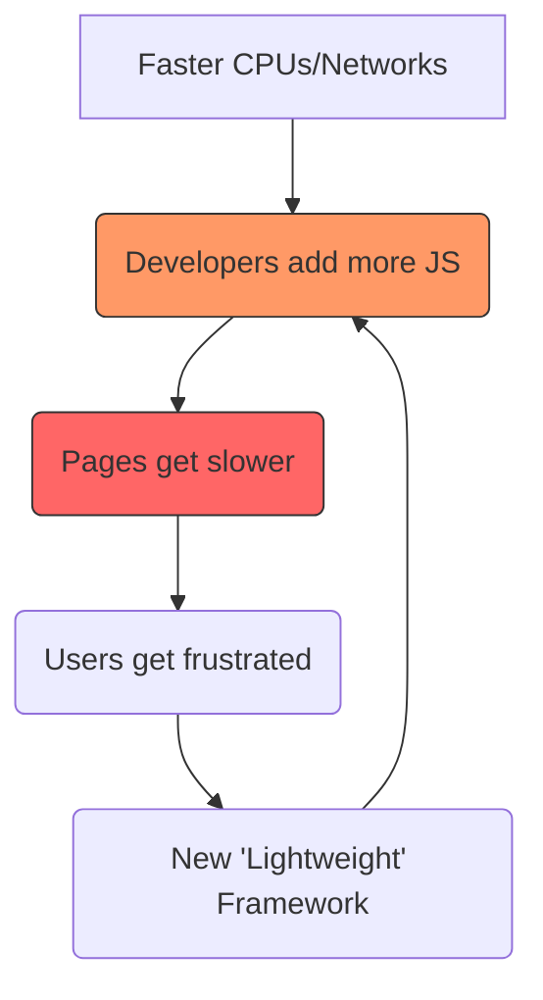

Remember the "MB-a-day" era? No, not data plans—I'm talking about the size of a single web page.

Back in 2022, the average web page was a bloated monster. You'd click a link and wait. And wait. While your browser downloaded three different analytics scripts, a half-dozen "engagement" trackers, two font families in five different weights, and a 4MB hero image that was destined to be covered by a cookie banner anyway.

Well, it’s 2026, and the trend has finally flipped. **Performance isn't just a metric anymore; it’s a status symbol.**

## The 1.0 MB Threshold

The most respected sites on the web today follow a simple, brutal rule: **The entire page, including all assets, must be under 1.0 MB.**

Why 1.0 MB? Because at that size, even on a spotty 5G connection or a crowded public Wi-Fi, the page feels *instant*. It feels like a physical object. You click, and it's there. No layout shift, no "skeleton screens," no shimmering placeholders. Just the content.

In 2026, we’ve realized that **speed is the ultimate UX**.

## The Bloat Cycle (and How We Broke It)

For years, we were stuck in a cycle where hardware got faster, so developers felt they could add more "weight" to their apps. It was a race to the bottom of the battery percentage.

We broke the cycle by realizing that users don't want "App-like experiences" for everything. They want **Documents**.

## The Tools of the Trade

How do you stay under 1.0 MB while still looking "2026"?

1.  **System Fonts:** We stopped downloading 500KB of custom woff2 files. `system-ui, -apple-system, Segoe UI`—these are beautiful, they're already on the user's device, and they cost 0 bytes.
2.  **SVG over PNG:** If it’s an icon or a simple illustration, it’s an SVG. Crisp at any resolution, and usually smaller than a thumbnail.
3.  **Vanilla is the New Framework:** We’ve returned to the [Terminal]() mindset. If you can do it with plain CSS and a few lines of JavaScript, why pull in a 100KB library?
4.  **Markdown First:** By writing in [Markdown](), we ensure our content is portable and lightweight by default.

## The Luxury of Respect

When a site loads instantly, it tells the user: "I respect your time. I respect your data plan. I respect your attention."

In an era of AI-generated noise and attention-economy traps, a lean, fast, [Local-First]() inspired website is a breath of fresh air. It’s the digital equivalent of a high-end analog watch—it does one thing perfectly, without needing a "Loading..." spinner to tell you it's working.

So, the next time you're building something, ask yourself: "Does this really need that third-party library? Or can I make it fly under the 1.0 MB mark?"

Load fast. Stay lean.

- [The Case for the Small Web]()
