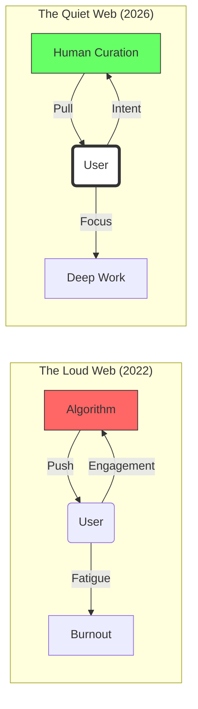

If you walked into a library in 2022, you expected silence. You expected a space where the architecture itself respected your focus. But if you walked onto the internet in that same year, it was like walking into a casino in the middle of a carnival that was currently being hit by a hurricane of confetti and neon advertisements.

Every tab was a slot machine. Every notification was a tug on your sleeve. Every "infinite scroll" was a trap door designed to keep you falling further into the abyss of the engagement algorithm.

Well, it’s 2026, and we’re finally collectively reaching for the volume knob. Welcome to the era of the **Quiet Web**.

## What is the Quiet Web?

The Quiet Web isn’t a specific technology or a single platform. It’s a design philosophy. It’s the realization that just because we *can* reach someone instantly doesn’t mean we *should*.

In 2026, the most respected digital spaces are those that are **asynchronous by default**. They don't have "active now" indicators. They don't show you "typing..." bubbles. They don't send push notifications for "someone you might know" or "a post you might like."

The Quiet Web is about **Low Velocity**. It’s the difference between a high-speed trading floor and a community garden.

## The Architecture of Silence

How do we build for the Quiet Web? It starts with the technical foundations we’ve been discussing all month.

1.  **Speed as Stillness:** As I mentioned in [The 1.0 MB Rule](), a fast site is a quiet site. When a page loads instantly, it doesn't jitter, it doesn't flash "loading" skeletons at you, and it doesn't make you wait in a state of cognitive suspense. It just exists.
2.  **Intentional Hardware:** We’re moving away from the "Everything Machine" and toward [Dedicated Devices](). A device that only does one thing is inherently quieter because it doesn't have a thousand other apps competing for your eyeballs.
3.  **Physical Boundaries:** We’re rediscovering the [Tactile Manifesto](). A physical switch to turn off Wi-Fi is worth a thousand "Do Not Disturb" software settings. It’s a loud statement for a quiet life.

## The Attention Economy vs. The Intention Economy

In the old "Loud Web," success was measured in "minutes spent." In the Quiet Web, success is measured in "value gained per second of attention."

The transition from "Push" to "Pull" is the most significant cultural shift of the decade. We’ve stopped being the product that the algorithms consume, and we’ve started being the curators of our own digital landscapes.

## The Joy of "Missing Out"

For years, we were haunted by FOMO (Fear Of Missing Out). In 2026, we’ve embraced **JOMO (Joy Of Missing Out)**.

There is a profound peace in knowing that you aren't seeing every tweet, every headline, or every "viral" video the moment it happens. By slowing down the velocity of our information intake, we actually improve our ability to process it. We’re trading the mile-wide, inch-deep river of the infinite scroll for the deep, still well of long-form thought.

The Quiet Web isn't about being "offline" (though that’s great too). It’s about being **online on your own terms**.

## How to Join the Silence

If you’re tired of the noise, you don't have to wait for the big platforms to change. They won't; their business models depend on your agitation. You have to build your own Quiet Web:

- **Switch to RSS:** Reclaim your feed.
- **Delete the "Infinite" Apps:** If it doesn't have a bottom, it's a trap.
- **Set "Office Hours" for Digital Life:** Just because the internet is 24/7 doesn't mean you have to be.
- **Support Small, Fast Sites:** Vote with your traffic for the developers who respect your time.

The future isn't loud. The future is focused.

Stay quiet. Stay intentional.

---

## Further Reading

- [The Case for Asynchronous Communication](https://doist.com/blog/asynchronous-communication/)
- [Digital Minimalism by Cal Newport](https://www.calnewport.com/books/digital-minimalism/)
- [The Small Web Movement]()
- [Why we're bringing back the button]()
