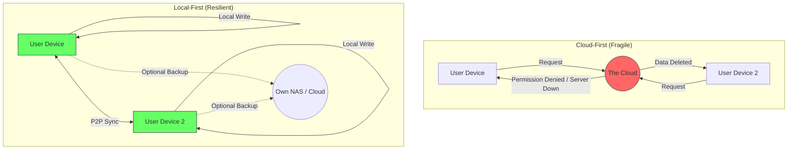

In the early 2020s, we were all digital nomads, whether we liked it or not. We lived out of suitcases packed by Google, Notion, and Slack. We didn't own our tools; we rented them. We didn't store our data; we "synced" it to a nebulous cloud that we hoped would stay rainy forever.

But as we discussed in [Digital Decay](), the cloud isn't a permanent atmosphere. It's a collection of private servers that can be turned off, sold, or "optimized" into oblivion at any moment.

Welcome to 2026, the year of **The Digital Homestead**. We're finally unpacking our bags and building on land we actually own.

## The Cloud Hangover

For a decade, the "Cloud-First" mantra was gospel. If it wasn't in the cloud, it didn't exist. We traded reliability for "collaboration" and ownership for "convenience."

Then came the Great SaaS Purge. We realized that when a service is "free," you aren't just the product; your *history* is the collateral. When those services started vanishing or pivoting to AI-only models that locked your data behind new paywalls, the "Cloud-First" dream became a "Cloud-Only" nightmare.

## What is Local-First?

Local-First isn't just "offline mode." It's a fundamental shift in how software is architected. In a local-first world:

1.  **The Local Copy is the Truth:** Your data lives on *your* device first. The server is just a secondary mirror for backup and optional sync.
2.  **Interaction is Instant:** There is no "loading" spinner because there is no network round-trip for basic operations. As I noted in [The 1.0 MB Rule](), speed is a feature of ownership.
3.  **Cross-Device Sync is Seamless:** Using protocols like CRDTs (Conflict-free Replicated Data Types), your phone and your laptop can talk to each other directly or via a "thin" relay without ever needing a central "Authority" to decide who's right.

## Fragile vs. Resilient Architecture

The difference is stark when you map it out. The Cloud-First model is a hub-and-spoke system where the hub is owned by someone else. The Local-First model is a mesh where *you* are the center.

## Why Now?

Why did it take until 2026 for this to go mainstream?

First, the tools got better. We moved from brittle SQL sync to robust local engines like SQLite (which, as we know, is [the most deployed software in the world]()).

Second, the culture changed. In the [Quiet Web](), we value the peace of mind that comes from knowing our tools will work in a tunnel, on a plane, or during a regional ISP outage. We've stopped chasing the "Infinite Stream" and started tending our "Digital Gardens."

## Homesteading Your Data

If you're ready to start your own homestead, here’s the 2026 checklist:

- **Audit your "Rentals":** Look at your primary tools. If the company went bankrupt tomorrow, could you still access your data? If the answer is no, it's time to move.
- **Choose Open Formats:** As we celebrated in the [Markdown Manifesto](), plain text is the ultimate insurance policy.
- **Support Local-First Devs:** Look for the "Local-First" badge on software. Support the developers who respect your sovereignty.
- **Build Your Own Infrastructure:** A simple NAS (Network Attached Storage) or even an encrypted SSD in a drawer is worth more than a lifetime subscription to a cloud storage provider.

The cloud was a great place to visit, but it's a terrible place to live. It's time to come home.

Stay local. Stay resilient.

- [Digital Decay & Persona Portability]()
