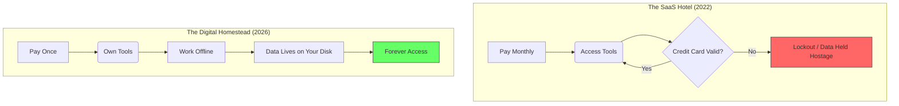

If you lived through the early 2020s, you remember the "Subscription Creep." It started innocently enough—a few bucks for Netflix, maybe a couple more for Spotify. But by 2023, it felt like your credit card was a leaky bucket. Your note-taking app? Subscription. Your code editor? Subscription. Your *car’s heated seats*? Subscription.

We were living in a world where we owned nothing and "rented" everything. We were digital nomads living out of a thousand different corporate hotels, and the bill was always due.

Well, it’s 2026, and the "Subscription Apocalypse" of last year finally broke the spell. Welcome to the era of the **Great Un-Subscription**.

## The Death of the "Recurring Revenue" Obsession

For a decade, VCs and CEOs worshipped at the altar of MRR (Monthly Recurring Revenue). They didn't want to sell you a tool; they wanted to sell you a *relationship* you couldn't escape.

But as we discussed in [The Local-First Revolution](), when the "Cloud" started feeling less like a service and more like a cage, people started looking for the exit. We realized that if you have to keep paying just to access the work you’ve already done, you aren't a customer—you're a tenant.

## Ownership is the Ultimate Feature

In 2026, the most successful software companies have rediscovered a "revolutionary" technology: **The Buy Button**.

When you buy a perpetual license today, you aren't just buying code. You’re buying **peace of mind**. You’re buying the certainty that your tools will work ten years from now, regardless of whether the company that made them still exists or decides to "pivot" to a new AI-first business model.

## The Mental Shift: Renting vs. Owning

The difference between the SaaS model and the Perpetual model is the difference between a hotel and a home.

## The "Maintenance" Compromise

Of course, software requires updates. In 2026, we’ve landed on a much more honest middle ground: **The Maintenance Model**.

You buy the software once. You own that version forever. If you want updates and support for the next year, you pay a small fee. If you don't? The software keeps working. It doesn't brick itself. It doesn't nag you with pop-ups. It just... stays there. Useful. Silent. Yours.

This is the model that built the [Quiet Web]() and the [Digital Homestead](). It respects the user's sovereignty.

## Why Perpetual is the New Luxury

In a world of infinite, disposable digital content, **permanence is a luxury**.

When I see a piece of software that offers a "Lifetime License," I don't just see a price tag. I see a developer who is confident enough in their product to let it stand on its own. I see a tool that I can integrate into my workflow without worrying about "Plan Tiers" or "Feature Sunsetting."

As we found in the [Markdown Manifesto](), the best tools are the ones that don't need a permission slip from a server to function.

## How to Un-Subscribe

If you’re ready to reclaim your digital sovereignty, here’s how to start:

1.  **Audit your "Leases":** Look at your bank statement. How many of those $10/month charges are for tools you could replace with a one-time purchase?
2.  **Seek the "Buy" Button:** Support the developers who still believe in ownership.
3.  **Embrace the "Slightly Older" Version:** In the old world, we were obsessed with having the "latest" everything. In 2026, we value the *stable* everything.
4.  **Tend Your Archive:** As I noted in [Digital Decay](), if you don't own the bits, they aren't yours.

The rent is too high, and the walls are too thin. It’s time to move out of the SaaS hotel and build something that lasts.

Stay sovereign. Stay permanent.

---

## Further Reading

- [The Local-First Vision (Ink & Switch)](https://www.inkandswitch.com/local-first/)
- [Conflict-free Replicated Data Types (CRDTs)](https://crdt.tech/)
- [Ownership vs. Access: A Philosophical Shift]()
- [Digital Minimalism (Cal Newport)](https://www.calnewport.com/books/digital-minimalism/)
