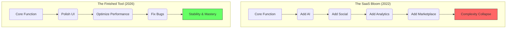

If you lived through the early 2020s, you remember the "Update Fatigue." Every time you opened your favorite note-taking app, there was a new sidebar. Every time you launched your code editor, there was a new "AI companion" begging for your attention. Every morning, you woke up to a dozen "What's New" pop-ups that mostly just explained how the things you liked had been moved or hidden behind a new subscription tier.

It was the era of the **Infinite Bloat**. We were trapped in a corporate cycle where software companies felt that if they weren't adding features, they were dying. They treated software like a shark—it had to keep moving or it would drown.

Well, it’s 2026, and we’ve finally discovered a radical new concept: **Software can be finished.**

## The Analogy of the Hammer

Imagine if you bought a hammer, and every two weeks, the manufacturer broke into your house and swapped the handle for a slightly different shape. One week it’s ergonomic; the next week it has a built-in Bluetooth speaker that you didn't ask for. A month later, the claw is gone because "data shows most users don't pull enough nails to justify the weight."

You’d be furious. You want your hammer to be a hammer. You want it to be a stable extension of your hand that you can rely on for twenty years.

For a long time, we didn't apply this logic to software. We expected—and were conditioned to want—constant change. But as we’ve learned in the [Quiet Web](), constant change is just another form of noise.

## The "SaaS Bloom" vs. The "Toolbox"

The problem with the modern SaaS model is that it demands "Value Growth." To justify the [Perpetual Subscription](), developers feel they must constantly justify the monthly fee with "newness." This leads to the **SaaS Bloom**—a beautiful product that eventually grows so many petals and thorns that you can no longer find the stem.

In 2026, we’ve returned to the **Toolbox Philosophy**.

## Mastery Requires Stability

You cannot achieve mastery over a tool that is constantly shifting under your fingers. Whether it's a piano, a lathe, or a text editor, mastery comes from the deep, subconscious spatial memory of where things are.

When a piece of software is declared "Feature-Complete," it isn't an admission of defeat. It’s a promise of reliability. It means the developers have found the "soul" of the product and decided to stop searching for more. It allows the user to stop being a "learner" and start being a "master."

## Why "Finished" is a Luxury

In the [Digital Homestead](), we value the things that last. A "finished" piece of software is a piece of software you can own. It’s a piece of software that won't break your workflow because a PM in Palo Alto needed to hit a KPI for "feature adoption."

Today, in 2026, the most prestigious software isn't the one with the longest changelog. It’s the one that hasn't needed a changelog in three years because it already does exactly what it’s supposed to do, perfectly.

## How to Find "Finished" Software

1.  **Look for the "1.0" that stayed 1.0:** Some of the best tools on my machine haven't had a major version bump since 2024. They just work.
2.  **Avoid "Roadmaps":** If a company’s primary selling point is what the software *will* do next year, they don't have a finished tool yet. They have a promise.
3.  **Support Independent Devs:** Indie developers are often brave enough to say "this is done." They don't have VCs breathing down their necks demanding 10x growth at the cost of utility.
4.  **Value the "Maintenance Only" Phase:** When a developer says they are moving a project into "maintenance mode," don't see it as a funeral. See it as a graduation.

The world is loud enough. Your tools should be quiet. They should be stable. They should be finished.

Stay stable. Stay finished.

---

## Further Reading

- [The Philosophy of 'Enough' in Product Design](https://example.com/enough-design)
- [Why I'm Moving Back to Simple Tools](https://example.com/simple-tools)
- [The Rise of the 'Feature-Complete' Badge](https://example.com/feature-complete)
- [The Local-First Revolution]()
