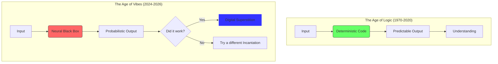

It’s Friday the 13th, February 2026. If you’re like me, you probably didn't walk under any ladders today. You might have even double-checked your backup servers just in case the universe decided to be particularly spicy. But the most interesting superstitions of 2026 aren't about black cats or broken mirrors. They’re about the glowing rectangles in our pockets and the "ghosts" we’ve invited into our code.

We like to think of ourselves as rational beings, especially those of us who work in tech. We deal in logic, binary, and deterministic systems. Or at least, we used to.

## The Return of the Magic Word

In the early 2020s, we had a brief period of extreme technical arrogance. We thought we had mapped every corner of the software stack. We had "Observability" and "Full-Stack Traceability." If something broke, we didn't pray; we looked at the logs.

But then came the LLM revolution. As I wrote in [Vibecode and the new creative loop](), we stopped wrestling with syntax and started painting with intent. We traded the rigid precision of C++ and Python for the fuzzy magic of natural language.

And with magic comes superstition.

Have you noticed how people "prompt" these days? We’ve moved past simple instructions. We’re back to incantations. "Take a deep breath." "Think step by step." "I’ll give you a $200 tip if you get this right." We are literally bribing and coaxing our tools like they’re temperamental deities. We don't know *why* telling an AI to "imagine you are a world-class architect" makes the CSS better, but we do it anyway. It’s the 2026 version of blowing into a Nintendo cartridge.

## The Abstraction Gap

The problem is that as our tools become more powerful, they also become more opaque. We’ve traded understanding for velocity.

When we can't see the gears turning, we start inventing myths to explain the movement. We start believing in "ghosts in the code"—phantom patterns and hidden biases that we can't quite prove but feel in our bones. We’re back in the era of the "Digital Seance," trying to summon the right response from a machine that is fundamentally a stochastic mirror of our own collective consciousness.

## Why This Matters

This isn't just a fun observation for a Friday the 13th. It’s a warning about the [Digital Homestead]().

If we treat our tools as magic, we lose our agency. We stop being builders and start being worshippers. When a system is "too complex to understand," we stop trying to fix it and start trying to appease it. This is exactly what the big corporate players want—a world where the tech is so mystical that you wouldn't dream of opening the hood.

In [The 'Feature-Complete' Myth](), I talked about the beauty of finished tools. Part of that beauty is **legibility**. A finished tool is one you can eventually master because its boundaries are fixed and its logic is discoverable. An AI model that changes its "personality" every week is the opposite of that. It’s a ghost that won't stay still.

## Reclaiming the Light

So, how do we fight digital superstition in 2026?

1.  **Exorcise the Black Box:** Whenever possible, use [Local-First]() models. When the weight lives on your disk, the "magic" feels a lot more like math.
2.  **Debug the "Why," Not Just the "What":** Don't just keep tweaking the prompt until it works. Try to understand the training data, the temperature settings, and the constraints.
3.  **Value Determinism:** Don't use a "vibe" when a line of code will do. If you can solve a problem with a simple script, don't throw a trillion-parameter model at it.
4.  **Stay Skeptical:** Just because the machine sounds confident doesn't mean it’s right. The "ghost" is usually just a reflection of your own expectations.

The world is full of real mysteries. Our tools shouldn't be one of them. This Friday the 13th, let’s commit to bringing our tech back into the light of understanding.

Stay curious. Stay grounded.

- [Your Data, Your Computer]()
- [The Rise of the Quiet Web]()
