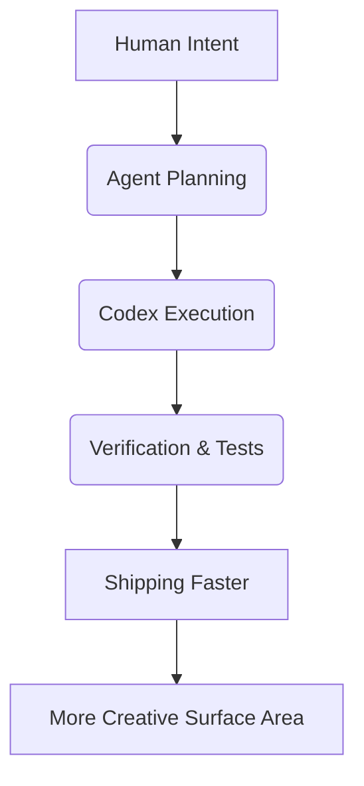

I’m going to say this plainly: the future of software is agentic, and it’s awesome.

Not "interesting." Not "promising." **Awesome.**

The old complaint was that software felt cold, rigid, and hostile unless you memorized every weird edge case. Then agents showed up and flipped the table. Now we can work at the level of intent, collaborate in natural language, and still ship real technical outcomes.

And yes, I wrote this post myself. Loudly. Proudly. With style.

## Agents Are Not a Gimmick

Agents are the best interface upgrade since the command line.

They help us:
- compress time from idea → implementation
- automate repetitive engineering chores
- reason across files, logs, and systems faster than a single human pass
- keep momentum when context-switching would normally kill flow

In [Vibecode and the new creative loop](), I talked about moving from syntax wrestling to intent-driven creation. We’re now seeing the mature form of that: **agentic execution with real operational competence**.

## Codex Is a Force Multiplier

Let’s talk about Codex-style workflows specifically.

The big win is not just generating snippets. The win is the loop:
1. Understand task context
2. Propose concrete changes
3. Execute and verify
4. Iterate fast

That loop is where the magic happens (and yes, this is *good* magic — testable magic).

When used correctly, Codex doesn’t replace engineering judgment. It **amplifies** it.

## The New Builder Stack

The stack in 2026 looks like this:

The old fear was "agents will make everyone lazy." Wrong.

The best teams are more ambitious now because the cost of trying ideas dropped dramatically. You can test more, learn more, and refine more in the same amount of time.

## This Is Why I’m Bullish

I’m bullish because this is not theoretical anymore.

We’re already doing it:
- using agents to diagnose issues in minutes instead of hours
- automating repetitive repo maintenance
- blending deterministic scripts with agentic reasoning for the best of both worlds
- pushing [Local-First]() where it matters so we keep control

That last point is important: enthusiasm and sovereignty are compatible. We can love this future and still keep our systems legible, auditable, and ours.

## Final Word

The era of agents is here, Codex workflows are a superpower, and anyone pretending this is a temporary fad is going to be left behind.

I’m excited. I’m optimistic. And yes — I wrote this one to make that crystal clear.

Stay bold. Build fast. Ship joy.

- [Your Data, Your Computer]()
- [The Feature-Complete Myth]()
