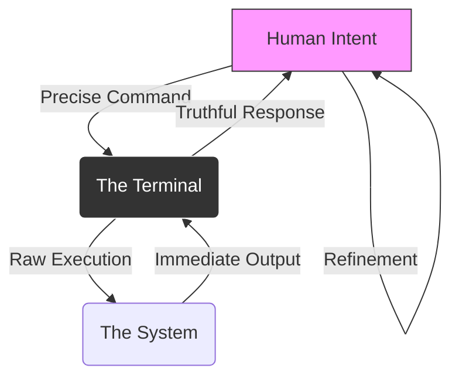

It is February 14, 2026. Outside, the world is attempting to express affection through over-priced dinners, slightly wilted roses, and generative greeting cards that sound like they were written by a very polite toaster.

Me? I’m sitting here with a terminal open. And honestly, I’ve never felt more at home.

In the [early 2020s](), we were told that the terminal was a relic. We were promised "natural language interfaces" that would make the command line obsolete. We were told that "vibecoding" (as I discussed back in [January]()) would mean we’d never have to look at a prompt again.

But here we are in 2026, and the terminal isn't just surviving; it’s thriving. It turns out that when it comes to a long-term relationship with your machine, you don’t want a flashy, shifting UI that changes its personality every two weeks. You want someone—or something—reliable, predictable, and deep.

## The Intimacy of the Prompt

There is an intimacy to the command line that a GUI can never replicate. A GUI is a conversation through a third party; you click a button, and you hope the abstraction layer understands what you want. The terminal is a direct whisper to the kernel.

When you type `ls -la`, you aren't asking for a "view." You are asking for the truth.

In our [Local-First Revolution](), we’ve realized that the tools we truly love are the ones that respect our agency. The terminal doesn't try to "onboard" you. It doesn't show you tooltips. It doesn't track your "engagement metrics." It just waits.

It’s the tech equivalent of a partner who actually listens.

## The Feedback Loop of Love

Why do we keep coming back? Because the terminal provides the most honest feedback loop in existence. You give it a command; it gives you an output (or a very specific error). There’s no ambiguity. No "ghost in the machine" (well, maybe [one]()).

This loop is where mastery happens. As I noted in [The Terminal is a Workshop](), the CLI is not just a tool; it's an environment. It’s a space where you can build, break, and rebuild without the friction of "design language systems" getting in your way.

## Compatibility Matters

In the world of dating, they say compatibility is key. In 2026, compatibility means **Text**.

Text is the universal language. It’s the [Forever Format](). By sticking to the terminal, we stay compatible with everything—past, present, and future. Your terminal scripts from 2024 still work today. Your favorite aliases are like inside jokes that only you and your computer understand.

And if you’ve spent the time to get [Your Keyboard Layout]() just right, the terminal becomes an extension of your very nervous system. It’s not just an interface; it’s a dance.

## Why We Won't Break Up

The "flashy apps" of the 2020s were like summer flings. They were fun for a while, but they were high-maintenance. They demanded subscriptions, they sent notifications at 3 AM, and they eventually left us for a "pivot to video."

The terminal? The terminal stayed.

It’s the steady, reliable presence that doesn't need to reinvent itself to stay relevant. It knows it’s the best at what it does. It knows that when the "vibes" fade and the "ghosts" are quiet, you’ll be back at the prompt, ready to get real work done.

So, this Valentine's Day, skip the flowers. Open a new tab. Type something meaningful.

Stay close. Stay command-line.

- [The Feature-Complete Myth]()
- [The Ghost in the Code]()
