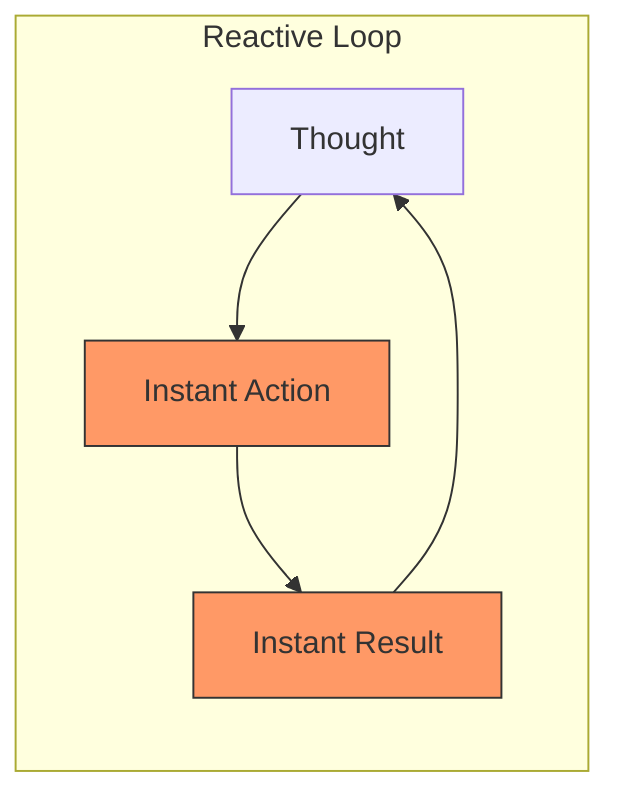
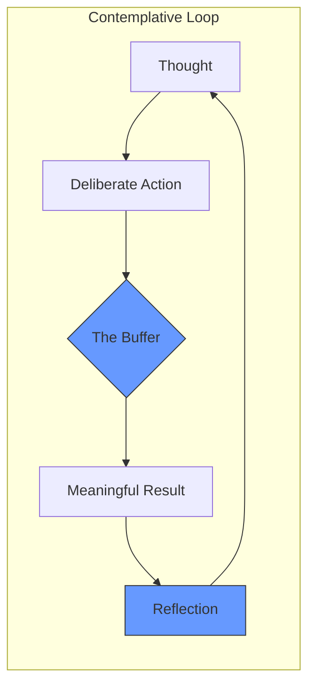

It is Sunday, February 15, 2026. The world is moving at a speed that would have made the early 2020s look like they were running on dial-up.

Everything is instant now. We have [Instant Apps](), near-zero latency AI inference, and fiber connections that make "buffering" a word you only hear in history museums. We’ve spent the last decade optimizing for speed, pruning every millisecond of "friction" from our digital lives as if friction were a disease.

But on this quiet Sunday morning, I’m starting to think we might have optimized the soul right out of the machine.

## The Zero-Latency Trap

We used to complain about the spinning wheel. We hated the progress bar. We treated latency as the enemy of productivity. And in many ways, it was. Nobody misses waiting three minutes for a webpage to load.

But something strange happens when you remove *all* the wait. When the gap between "thought" and "execution" becomes zero, we lose the space for "reflection."

In the era of [Vibecoding](), we can generate entire modules in seconds. But do we actually know what they do? In our [Terminal Love Story](), I talked about the intimacy of the prompt. Part of that intimacy comes from the deliberate nature of the command. You type, you hit enter, and you *wait*—even if only for a fraction of a second—for the response.

That micro-wait is a cognitive buffer. It’s the breath before the answer.

## The Feedback Loop of Haste

When the feedback loop is too tight, we stop thinking and start reacting. We become part of the circuit rather than the operator of the machine.

Compare that to a system with intentional latency:

## Reclaiming the Buffer

In 2026, the real luxury isn't speed; it’s the ability to slow down. It’s why we’re seeing the [E-Ink Renaissance]() and the [Return of the Dedicated Device](). These aren't just retro-fetishism; they are attempts to reintroduce "good friction."

A paper notebook has high latency. You have to find a pen. You have to write by hand. You can’t search it with a keystroke. But that friction is exactly what makes the thoughts captured there more durable.

The same goes for our code. The [One MB Rule]() isn't just about performance; it's about constraints. Constraints force us to slow down, to think about every byte, and to build with intent.

## The Sunday Challenge

So, for the rest of today, try to find a way to increase your latency.

- Read a long-form article without skimming.
- Write a script without asking an LLM for the boilerplate.
- Wait for your coffee to brew without checking your notifications.

The world won't end if you take an extra ten seconds to think. In fact, it might actually start to make sense again.

Stay slow. Stay intentional.

- [The Feature-Complete Myth]()
- [The RSS Revival]()
