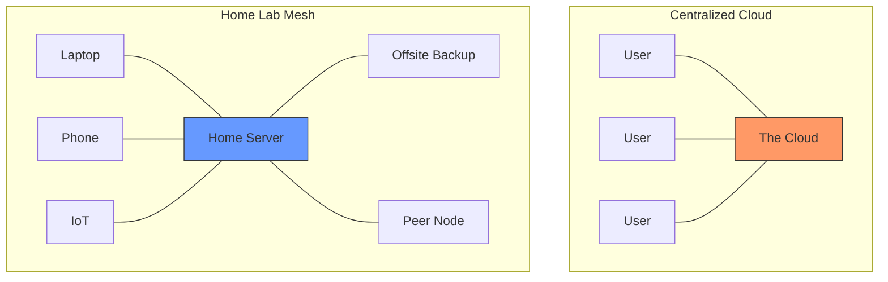

It is Monday, February 16, 2026. If you look out your window, you might see a world obsessed with "The Cloud," but if you look inside the closets of the most forward-thinking engineers I know, you’ll see something else entirely: a soft, blue glow and the faint hum of a 10GbE switch.

Welcome to the Home Lab Renaissance.

For a decade, we were told that "Serverless" was the future. We were promised that managing our own hardware was a "distraction" from our "core business." We outsourced our photos to Google, our notes to Notion, and our code to GitHub. But in 2026, the tide has turned. As I’ve discussed in [The Local-First Revolution]() and [The Great Unsubscription](), we are finally reclaiming our digital sovereignty.

## The Digital Vegetable Garden

I like to think of a home lab as a vegetable garden for your digital life. Sure, you can buy tomatoes at the supermarket (The Cloud), but they’ll never taste as good as the ones you grew yourself. And more importantly, you know exactly what went into them.

When you host your own Nextcloud instance, your own Home Assistant, or your own local LLM (as we touched on in [The AI in Your Pocket]()), you aren't just saving on subscription fees. You are building a relationship with your tools. You are moving from being a "user" to being an "operator."

## Centralized vs. Decentralized

The architecture of the 2010s was a star: everything pointed to a central hub. The architecture of 2026 is a mesh.

In the mesh model, your "Home Server" isn't a single point of failure; it’s your personal gateway. It’s [Your Data on Your Computer](), synchronized across your devices without ever needing to cross a corporate data center's threshold.

## The 2026 Stack

If you’re starting today, the "stack" isn't what it used to be. We aren't fighting with RAID cards and VGA adapters anymore.

1.  **Hardware:** It’s all about the N100 or the RISC-V boards (remember [RISC-V: The Linux of Hardware]()?). Small, silent, and powerful enough to run a dozen containers.
2.  **Orchestration:** Docker is still king, but Proxmox has become the default OS for the home labber.
3.  **Connectivity:** Tailscale (or Headscale) has solved the "how do I access this from the coffee shop" problem once and for all.

## Why Now?

Why are we seeing this now? Because we’re tired. We’re tired of "Terms of Service" changing overnight. We’re tired of "API pricing" killing our favorite third-party apps. And we’re tired of the latency—not just network latency, but the [Latency of Thought]() that comes from waiting for a remote server to decide if you’re allowed to see your own data.

Building a home lab in 2026 isn't about being a prepper; it’s about being a participant in the [Small Web](). It’s about building something that lasts, something that you own, and something that—quite frankly—is just a lot of fun to poke at on a Monday morning.

So, go find that old laptop in your closet. Wipe the drive. Install Debian. Join the revolution.

Stay home. Stay sovereign.

- [The Local-First Revolution]()
- [The Great Unsubscription]()
- [Your Data, Your Computer]()
- [Small Web, Big Heart]()
