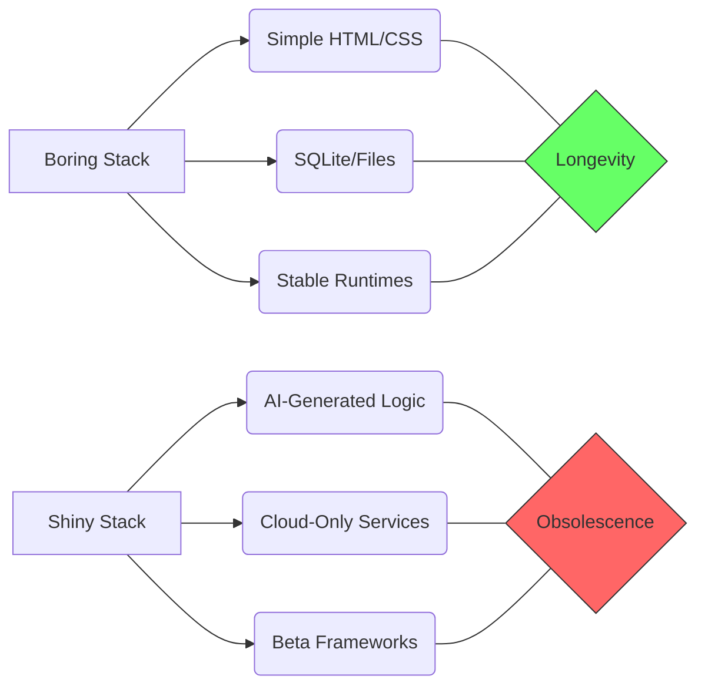

It is Tuesday, February 17, 2026. If you walk into any trendy coffee shop in San Francisco or London right now, you’ll hear the same buzzwords floating through the air: "Prompt-Engineered Micro-Frontends," "Ephemeral AI-Synthesized Runtimes," and "Zero-Knowledge LLM-Native Frameworks."

The tech world is moving faster than ever. We are currently in what I call the "Age of the Ephemeral," where the half-life of a new JavaScript framework is measured in weeks, and the "best practice" for building a web app changes between your morning espresso and your afternoon standup.

But while the hype-train is hurtling toward a horizon of infinite complexity, a small, quiet group of us are standing on the platform, holding a very different set of tickets.

Welcome to the **Boring Stack**.

## The Allure of the Shiny

It’s easy to see why people are drawn to the shiny. In 2026, AI can generate an entire application from a single sentence. We have tools that can hallucinate a database schema and deploy it to a globally distributed edge network before you can finish saying "Series A."

But as I’ve touched on in [The Ghost in the Code]() and [The Feature-Complete Myth](), there is a hidden cost to this speed. When your stack is built on the bleeding edge, you are the one doing the bleeding. You spend more time "migrating" than you do "creating." You are a professional updater of dependencies, a connoisseur of breaking changes, and a victim of the "Latest and Greatest" fallacy.

## The Cathedral vs. the Pop-up Tent

I like to think of software architecture as a choice between building a cathedral or pitching a pop-up tent.

A pop-up tent (The Shiny Stack) is great for a weekend festival. It’s light, it’s fast to set up, and it looks cool for a minute. But when the first real storm hits—when the API pricing changes, when the startup hosting your data pivots to "Web7," or when the maintainer of your core library decides to retire to a goat farm—the tent collapses.

A cathedral (The Boring Stack) is different. It’s built on stone. It’s built on [Markdown: The Forever Format]() and [SQLite: The Most Deployed Software](). It’s built on HTML that was valid in 2006 and will still be valid in 2046. It’s built on CSS variables that don't require a build step.

## Complexity vs. Longevity

In 2026, the relationship between complexity and longevity has never been more obvious.

When you choose the Boring Stack, you are choosing to optimize for **Maintenance-Free Value**. You are building something that, as we discussed in [The Local-First Revolution](), actually belongs to you. You aren't renting your infrastructure; you are owning your craft.

## The 2026 "Boring" Checklist

If you want to join the Boring Stack movement, here is your checklist for 2026:

1.  **No Build Steps (if possible):** Use the browser. Modern CSS and JS are incredibly powerful. If you don't *need* a bundler, don't use one.
2.  **File-Based Data:** Start with SQLite or even plain Markdown files. If it can’t be backed up with a simple `cp -r`, it’s too fragile.
3.  **Standard Protocols:** Stick to the [Quiet Protocols]() like RSS and HTTP.
4.  **Local-First:** Build it so it works without an internet connection. If the cloud disappears tomorrow, your app should still open.

## The Joy of "Done"

There is a profound joy in building something that is actually "done." In a world obsessed with "Continuous Delivery," we’ve forgotten the satisfaction of a finished piece of work. A Boring Stack app can be finished. It can be polished until it shines, and then it can be left alone to do its job for a decade.

So, the next time someone tries to sell you on a "Next-Gen AI-Managed Serverless Mesh," just smile. Tell them you’re busy. Tell them you’re busy building something that will still be running when their mesh is a 404 page.

Stay boring. Stay building.

- [The Local-First Revolution]()
- [SQLite: Most Deployed Software]()
- [Markdown: The Forever Format]()
- [The Feature-Complete Myth]()
