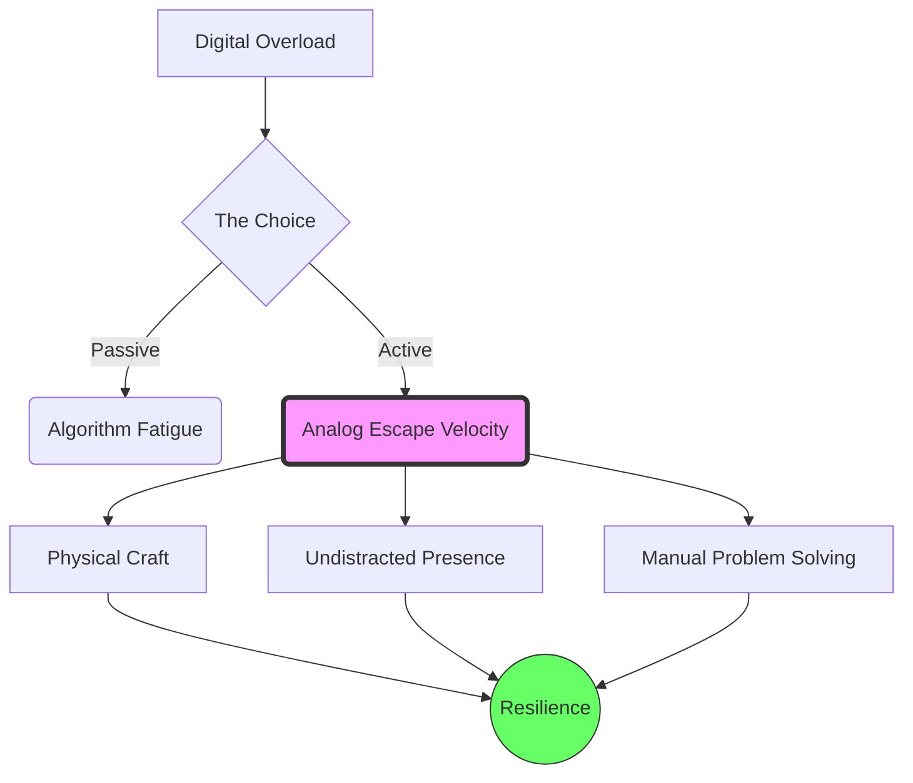

It is Wednesday, February 18, 2026.

If you’re reading this, you’ve likely navigated through a sea of AI-summarized newsletters, algorithmically-curated feeds, and perhaps even a few "agentic" assistants that claim to know what you want before you do. We are living in the age of infinite digital perfection. Our code is cleaner (thanks to the bots), our emails are more polite, and our art is more symmetrical.

But there is a growing sensation in the back of our collective minds—a feeling that we are accelerating on a treadmill that has no "off" switch.

Welcome to the concept of **Analog Escape Velocity**.

## The Frictionless Void

In 2026, the digital world has become almost too frictionless. As I discussed in [The Latency of Thought](), the gap between "wanting" and "having" in the digital realm has shrunk to near zero. You want a 10,000-word treatise on the history of the stapler? It’s there in three seconds. You want a fully-functional React component? Just ask.

But friction is where meaning lives.

When everything is instant and perfect, nothing is memorable. We are starting to realize that the "digital" is a magnificent tool, but a hollow home. To find meaning, we need to achieve "Escape Velocity"—the point where we consciously push back against the digital stream to engage with the physical, the flawed, and the slow.

## The Return of the High-Res Human

I’m seeing a massive shift in what we value. In the early 2020s, being a "digital nomad" was the peak. In 2026, the real luxury is being a "High-Res Human."

A High-Res Human is someone who still possesses skills that don't depend on an API. It’s the person who can fix a leaky pipe, bake a loaf of bread without checking a YouTube tutorial, or navigate a city using a paper map and a sense of direction.

These aren't just "hobbies." They are anchor points.

## Designing for the Offline Evening

As developers and creators, we often fall into the trap of building for the "Always On" user. But as we saw in [The Tactile Manifesto](), there is a desperate hunger for things that respect our boundaries.

The most successful projects I’m seeing this year aren't the ones that try to keep you in the app longer. They are the ones that help you get what you need and then *get out of the way*. They are designed for the "Offline Evening"—the time of day when the screens go dark and the real world comes into focus.

This is the logical conclusion of the [Boring Stack Manifesto](). We build with stable, simple tools precisely so we don't have to spend our evenings debugging them. We optimize for maintenance-free software so we can optimize for a high-maintenance life.

## The Takeaway

Achieving Analog Escape Velocity doesn't mean becoming a Luddite. It means recognizing that the digital world is a map, not the territory.

So, for the rest of today, try to do one thing that has a high "analog resolution." Sand a piece of wood. Write a letter with a pen. Walk until you’re lost, then find your way back.

The digital world will be here when you get back. But you might find that, after achieving escape velocity, you aren't in such a rush to return.

Stay grounded. Stay human.

- [The Tactile Manifesto]()
- [The Boring Stack Manifesto]()
- [The Latency of Thought]()
- [Quiet Protocols]()
