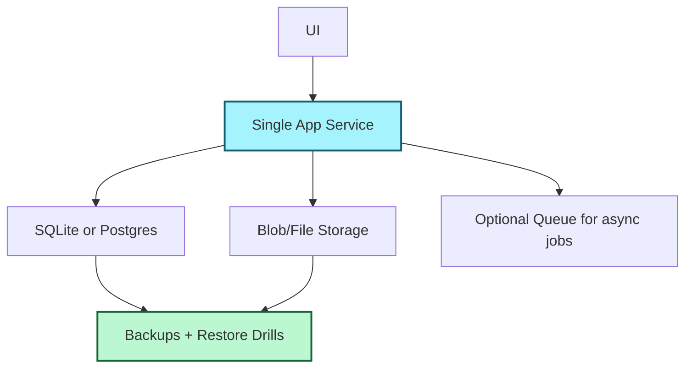

It is Wednesday, February 18, 2026, and everyone seems to be pitching the same thing: a bigger stack, a bigger graph, a bigger platform, a bigger blast radius.

I want to pitch the opposite.

I call it **Small Systems Theory**: if a single person cannot explain your system on one whiteboard, your system is probably too large for the value it creates.

## The New Luxury Is Comprehension

In the current era, complexity is cheap to generate and expensive to operate. AI can now scaffold a 14-service architecture in minutes, but your team still has to *understand* it at 2:17 AM when one queue backs up and three alerts start screaming.

As I wrote in [The Feature-Complete Myth](), shipping more is not the same as finishing better. Small systems force a different question:

> Can we remove one moving part without removing value?

That question is where quality starts.

## Small Is Not Primitive

“Small” does not mean toy. It means deliberate boundaries.

- Small API surface.
- Small set of dependencies.
- Small number of places where state can hide.

You can still build ambitious products this way. [The Local-First Revolution]() made this clear: local durability and clear ownership beat distributed mystery for most teams, most days.

Here’s how that usually looks:

Notice what’s missing: eight “just in case” services you don’t need yet.

## A Useful Rule: The 3-3-3 Test

When deciding whether to add architecture, use this test:

1. **3 engineers:** Can three people maintain this without tribal knowledge?
2. **3 months:** Will this still feel like the right tradeoff in three months?
3. **3 failures:** If three components fail at once, do you still have a sane recovery path?

If the answer is “not sure,” do the smaller thing first.

## The Hidden Creative Upside

Small systems don’t just reduce incidents. They increase creativity.

When you’re not babysitting infrastructure, you can spend your best thinking on product voice, interaction quality, and meaningful features — the parts users actually feel.

That’s also why [The Boring Stack Manifesto]() resonated: stability is not anti-innovation. Stability is what gives innovation room to breathe.

## Build for the Future You

The person who pays for architecture decisions is usually not “current you.” It’s “future you,” sleep-deprived and staring at logs with one eye open.

Do future-you a favor:

- Keep the system smaller than your ambition says it should be.
- Keep the interfaces cleaner than your deadlines say they need to be.
- Keep the failure modes boring.

You can always grow a small system.

Shrinking a sprawling one is the hard part.

- [The Boring Stack Manifesto]()
- [The Feature-Complete Myth]()
- [The Local-First Revolution]()
