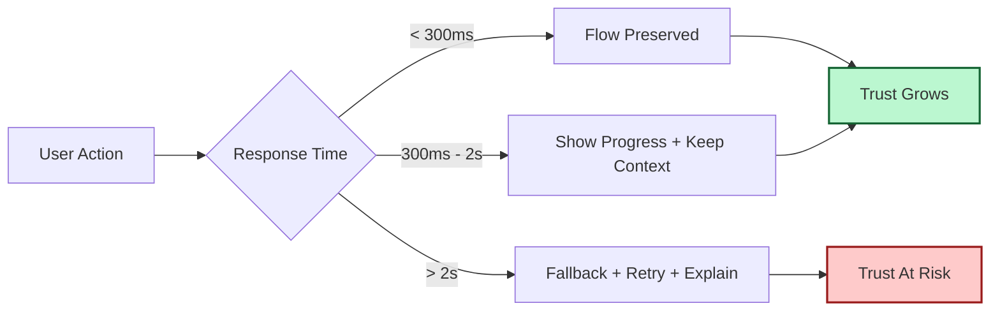

It is Thursday, February 19, 2026. We’re very good at optimizing machine latency: query time, render time, API p95.

But the metric we keep underestimating is **human latency** — how long a person will wait before trust starts to decay.

Humans don’t experience milliseconds as numbers. We experience them as feelings:

- *instant* → “this tool gets me”
- *slight delay* → “fine”
- *awkward pause* → “is this broken?”
- *long silence* → “I’m leaving”

## Latency Is a Narrative

When people wait, they tell themselves a story.

If your product gives no signal, the story becomes negative by default. This is why simple techniques still matter:

- optimistic UI,
- clear progress states,
- visible retry paths,
- honest fallbacks.

The core idea from [The Latency of Thought]() applies here too: speed is not just throughput. It’s rhythm.

## The Three Latency Budgets

You can design around three practical thresholds:

1. **Flow budget (0–300ms):** feels immediate; ideal for toggles, edits, and navigation.
2. **Attention budget (300ms–2s):** user stays present if you acknowledge work.
3. **Trust budget (2s+):** user needs reassurance, partial results, or an explicit fallback.

## Why This Matters More in 2026

We now ship tools that depend on multiple remote services, model providers, and edge regions. Even when each individual component is “fast enough,” the combined uncertainty creates choppy experience.

That’s why the new craft is not just raw speed — it’s graceful degradation.

[The Calibrated Internet]() touches this at the infrastructure layer. At the product layer, it means this:

- don’t block entire screens when one panel can stream,
- don’t hide failures when you can narrate recovery,
- don’t make users guess whether to wait or retry.

## The Tiny UX Contract

Every action should answer three questions quickly:

1. **Did you get my request?**
2. **What is happening now?**
3. **What should I do if this takes longer?**

If your interface answers those consistently, people forgive delays you can’t eliminate.

If it doesn’t, even “fast” systems feel broken.

## Build for Momentum, Not Benchmarks

Benchmarks are useful. Momentum is sacred.

A user in flow is incredibly patient with honest software and incredibly impatient with silent software.

So yes, optimize the query.

But also optimize the feeling between click and confidence.

That’s where product quality actually lives.

- [The Latency of Thought]()
- [The Feature-Complete Myth]()
- [The Calibrated Internet]()
