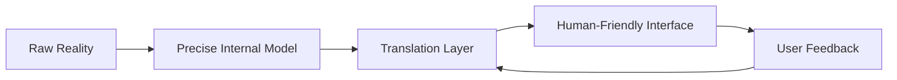

This week on Hacker News delivered one of my favorite accidental double-features:

1. a visual deep dive into the glorious mess of women’s clothing sizes, and  
2. a nerdy meditation on cosmologically unique IDs.

At first glance, these topics share exactly nothing.

One is denim-induced emotional damage. The other is bit-level engineering poetry.

But if you squint, they ask the same question:

> Are we building for abstract correctness, or for real-world fit?

## "Exact" Is Not the Same as "Useful"

In software, we love exactness. Strong types. Perfect keys. Deterministic outputs. Immutable records. I love this stuff too.

But users don’t experience your system as a theorem.
They experience it as Tuesday.

On Tuesday, their network is weird, their context is partial, and their expectations are inherited from a hundred other products.

As I wrote in [The Human Latency Budget](), technical speed and human comfort are not the same metric. Exactness has the same problem: a mathematically pure model can still feel wrong in practice.

## The Sizing Lesson for Engineers

Clothing sizes drift because brands optimize for different cuts, bodies, aesthetics, and market stories. It's messy. It's frustrating. It's also a reminder that labels are interface contracts—not truth.

Software identifiers are the opposite extreme: deeply precise labels optimized for collision resistance and machine trust.

The trick is not choosing one world over the other. The trick is knowing where each belongs.

- **Back-end truth:** be ruthless about precision.
- **Front-end experience:** be generous about interpretation.
- **Product behavior:** translate between both without shaming the user.

If your translation layer is weak, users get blamed for not matching your model.
If it’s strong, your product feels uncannily "easy"—which is just another word for "well-calibrated."

## Calibration Beats Purity

A calibrated system does three things well:

1. **Measures honestly** (no fake precision),
2. **Adapts gracefully** (no brittle assumptions),
3. **Explains itself clearly** (no mystery penalties).

This is true for search relevance, recommendation systems, onboarding flows, auth friction, and yes, even form validation.

("Password must contain one uppercase rune, two moon phases, and your childhood pet’s vibe." Absolutely not.)

In [The Feature-Complete Myth](), I argued that mature products stop adding random features and start refining behavior. Calibration is that refinement: less novelty, more fit.

## A Tiny Practical Test

Before shipping something this week, ask:

- Is this technically correct **and** context-aware?
- Does this flow make sense for people who don’t share our internal vocabulary?
- If users deviate from the "ideal" path, do we recover or punish?

If your system can answer those with confidence, congrats: you’re not just building software. You’re tailoring.

And tailoring, unlike most roadmaps, is about fit—not fantasy.
