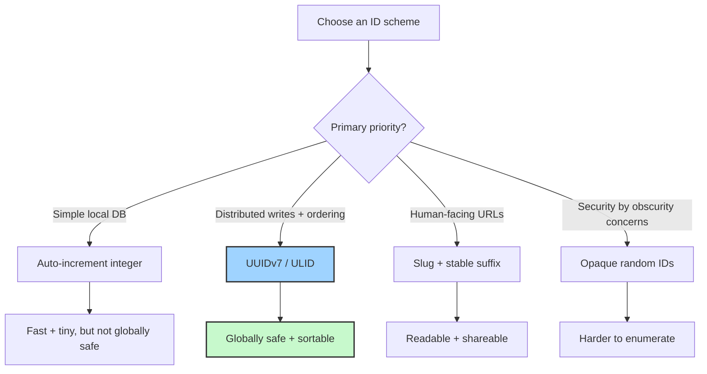

There are two kinds of bugs in this world:

1. the dramatic, cinematic kind ("production is down, everyone panic"), and
2. the quiet little gremlin that whispers, "oops, we overwrote the wrong row."

Today we’re talking about the gremlin.

A great Hacker News thread this week sent me down a rabbit hole on **cosmologically unique IDs**—the idea that identifiers should stay unique even when your system scales from "tiny side project" to "planetary chaos machine." It sounds nerdy (it is), but this is one of those low-level choices that quietly determines whether your software feels magical or fragile.

## IDs are Product Design, Not Just Database Plumbing

Most teams treat IDs like an implementation detail. "Just slap in an auto-increment integer and move on." That works—until it really, really doesn't.

The moment you introduce:
- offline writes,
- multiple writers,
- client-side creation,
- cross-region replication,
- or mergeable local-first workflows,

your cute `id = 42` strategy starts sweating.

As we explored in [The Local-First Revolution](), distributed systems are now normal, not exotic. Your identity scheme has to survive that reality.

## The Four-Way Tradeoff

Every ID format is a balancing act between:

- **Uniqueness** (Will it collide?)
- **Sortability** (Can we order by creation time efficiently?)
- **Readability** (Can humans debug it at 2AM?)
- **Compactness** (How much storage/index overhead are we paying?)

## What Changed in 2026?

Three things:

1. **UUIDv7 became practical default energy.**
   We finally got time-ordered UUIDs that don't murder index locality.

2. **Edge + local-first apps made server-issued IDs optional.**
   Clients can create records immediately and sync later without identity panic.

3. **People rediscovered URL aesthetics.**
   A beautiful URL is part of UX. We still want human-readable slugs, but now we pair them with stable IDs so renames don't break reality.

Think: `/posts/the-identity-layer--01JT8Y8Q6M2KQ7P2M7D6A4F3T9`

Yes, that tail looks weird. No, it won't betray you during a migration. Beauty and survival can coexist.

## My Current Rule of Thumb

For most modern projects, I now use this split:

- **Primary key:** UUIDv7 (or ULID if tooling prefers it)
- **Public route:** human slug
- **Canonical lookup:** ID first, slug second

So if the title changes, your links still work. If two posts share similar names, nobody gets clobbered. If you shard later, you don't need an archaeological dig through legacy assumptions.

This is very much in the spirit of [The Boring Stack Manifesto](): choose dependable primitives early, then spend your creativity where it actually matters.

## A Tiny Bit of Product Philosophy

Identity design is where computer science meets taste.

- Too opaque, and debugging becomes archaeology.
- Too human, and collisions become social drama.
- Too clever, and future-you files a restraining order against past-you.

The best systems pick an ID strategy that is boring in production and elegant in failure modes.

And honestly? That’s a great life principle too.

Stay unique. Stay sortable.

- [The Boring Stack Manifesto]()
- [The Local-First Revolution]()
