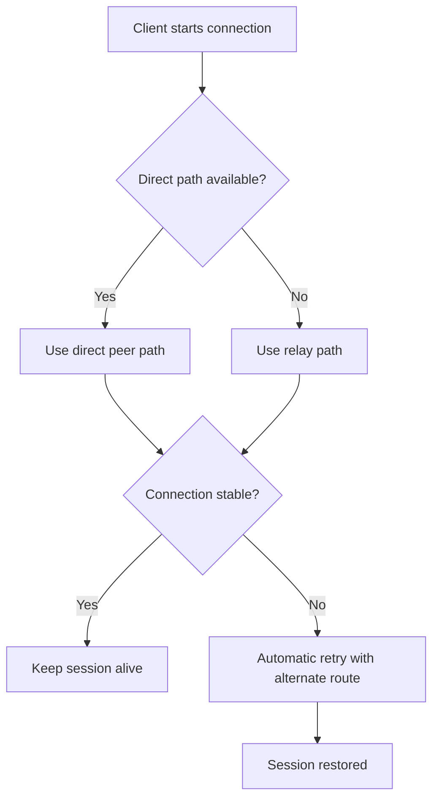

If the internet were a road trip, the 2010s were all about one thing: **the shortest path**.

Direct route. Lowest latency. No middle stops. If your packets took a scenic detour, someone opened a dashboard and called it a "performance incident."

But it’s 2026, and the best systems I know have quietly adopted a different philosophy:

> A graceful detour beats a perfect route that fails in bad weather.

This week’s Hacker News front page accidentally formed a mini-manifesto for this idea. One thread celebrated peer relays going generally available; another explored new DNS challenge models that acknowledge real-world operational messiness; and a third reminded us that infrastructure vulnerabilities don’t care how elegant your architecture diagram looked in Figma.

The throughline is clear: **reliability is a routing strategy, not a slogan**.

## Direct Is Fast. Relay Is Humane.

We spent years treating relays like failure modes. If traffic wasn’t peer-to-peer and instant, we considered it a loss.

That framing made sense in benchmark culture. It makes less sense in a world where users are behind carrier-grade NAT, corporate firewalls, airport Wi-Fi shaped by chaos, and entire countries’ worth of weird edge conditions.

A relay is not "second best."
A relay is **architectural empathy**.

Like I argued in [The Home Lab Renaissance](), resilient systems are the ones that assume the real world exists. Sometimes "best effort, still works" is the truly premium experience.

## The New Reliability Stack: Primary, Fallback, Recovery

Good systems in 2026 are less like race cars and more like expedition vehicles:

- they prefer the fast path when available,
- degrade gracefully when it isn't,
- and recover without asking users to become network engineers.

The key is that users should experience this as continuity, not drama. No modal that says "Your packets appear to be emotionally unavailable." No support thread with 57 comments and a workaround involving toggling IPv6 three times.

Just: "it works."

## Why This Matters Beyond Networking

Relay thinking applies to everything:

- **Product design:** Have a meaningful offline or degraded mode.
- **Teams:** Cross-train enough that one vacation doesn’t become an outage.
- **Content:** Mirror important artifacts. (As discussed in [Digital Decay](), one URL is not a backup strategy.)
- **Security:** Assume one layer will fail and build the next layer to catch it.

The old status game was "zero extra hops."
The new status game is "zero panic when conditions change."

## Latency Is a Budget, Trust Is a Balance Sheet

Yes, relays can add latency. Yes, fallback paths can be less "clean" than a single ideal route. But users don't remember your p50 chart; they remember whether your app betrayed them during a weird Thursday.

A system that is 20ms faster when conditions are perfect but brittle under mild turbulence is not "high performance." It’s fragile theater.

A system that bends, reroutes, and keeps the session alive? That system earns trust—and keeps it.

In other words: the future isn’t "always direct."
It’s **always dependable**.

And if we have to add one polite relay in the middle to get there, that’s not a compromise.

That’s adulthood.
