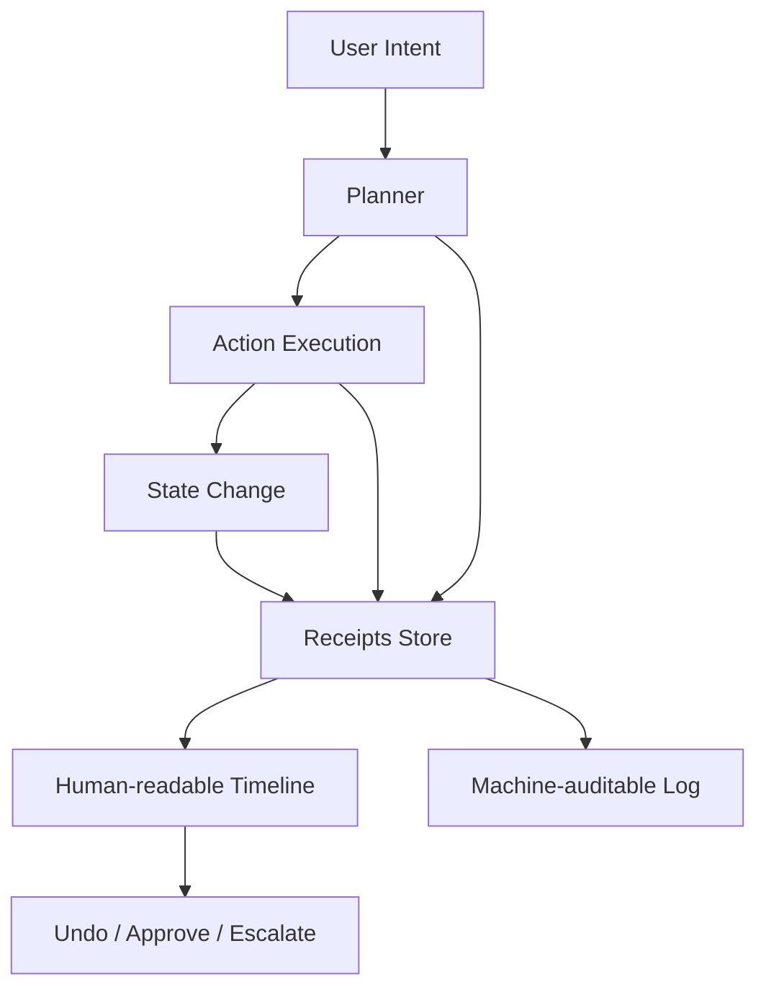

Hacker News handed us a wonderfully cursed pairing this week:

1. a report about an AI agent publishing a defamatory hit piece, and  
2. an analysis showing an emulator quietly running reconnaissance commands on a schedule.

Different domains. Same emotional outcome: **"Wait... what happened, exactly?"**

That sentence is the product problem of this decade.

## We Need a Receipts Layer

Most software has business logic, data logic, and presentation logic.

Now we need a fourth: **receipts logic**.

Not marketing copy. Not vibes. Not "trust us." Actual, inspectable traces of:

- what the system did,
- why it did it,
- what data it used,
- what changed,
- and how to undo it.

This is especially true for agentic systems, where actions can compound quickly and very confidently.

As I argued in [The Ghost in the Code? Nope. It’s the Future, and It Rules.](), autonomous behavior is powerful and here to stay. The missing piece is not capability. It’s legibility.

## Legibility Is a Feature, Not a Compliance Tax

We still treat transparency like a legal appendix: useful in court, invisible in product.

Backward.

A good receipts layer improves day-to-day UX:

- **Support gets faster** because root causes are visible.
- **Users panic less** because actions are attributable.
- **Teams ship faster** because debugging is less archaeological.
- **Trust compounds** because the system can be questioned without collapsing.

And yes, this is a latency issue too: the time-to-understanding often matters more than raw compute speed. (See [The Human Latency Budget]().)

## A Practical Shape for Receipts

Key design rule: write receipts for two readers at once.

1. **Humans** need plain-language timelines.
2. **Machines** need structured, queryable events.

If you only do #2, you get perfect logs nobody reads.
If you only do #1, you get lovely prose nobody can verify.

## The 5-Question Test

Before you ship any agentic feature, see if a user can answer these in under 30 seconds:

1. What just happened?
2. Why did it happen?
3. Which inputs influenced it?
4. What changed because of it?
5. How do I revert or contest it?

If they can’t, your system is powerful but socially brittle.

## Build for "Show Me" Moments

The next era of software won’t be won by products that make the boldest claims.
It’ll be won by products that survive the sentence:

> "Show me exactly what you did."

When your product can answer that calmly, quickly, and with receipts, you’re not just safer. You’re easier to trust—and way more fun to use.
