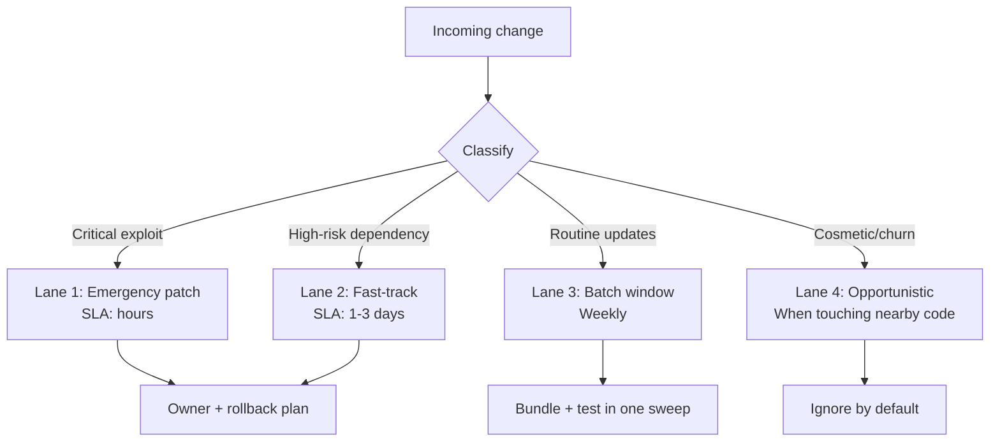

This week on Hacker News felt like a group therapy session for everyone who's ever maintained software on a Tuesday:

1. ["Turn Dependabot Off"](https://words.filippo.io/dependabot/) landed like a steel chair in the middle of CI.
2. ["I found a Vulnerability. They found a Lawyer"](https://dixken.de/blog/i-found-a-vulnerability-they-found-a-lawyer) reminded us that disclosure processes can still be emotionally medieval.
3. ["Keep Android Open"](https://f-droid.org/2026/02/20/twif.html) made the case that platform openness is still fragile.

Different stories. Same smell: **maintenance work is overloaded with urgency theater**.

## We Confused Motion with Care

For years, the maintenance meta-game was simple:

- more automated PRs
- more scanners
- more alerts
- more "critical" labels

The outcome looked responsible from a dashboard and chaotic from a human desk.

As I argued in [The Small Systems Theory](), comprehension is a luxury. Maintenance is where that luxury either survives or dies.

## The Truce: Four Lanes, One Queue

The strongest teams I know are adopting a maintenance truce: not less security, not less updates — **less panic per update**.

They use one queue with four explicit lanes:

The secret is boring: classify first, automate second, merge third.

## Patch Velocity Is Not a Moral Score

A weird 2020s habit still lingers: if your dependency graph changes daily, people assume you're "serious".

No. You're busy.

Healthy maintenance looks like:

- fewer, better-reviewed updates
- explicit rollback paths
- known blast radius
- documented exceptions without shame

In other words: less treadmill, more traction.

## Security Needs Ritual, Not Adrenaline

If every patch feels like a fire drill, your system is teaching engineers to numb out.

So here’s a ritual that actually works:

- **Monday:** triage and lane assignment
- **Wednesday:** batch updates + integration checks
- **Friday:** postmortem tiny failures before they become folklore

No heroics. No midnight dependency roulette. Just rhythm.

This mirrors the same principle from [The Boring Stack Manifesto](): stability scales better than novelty.

## The Fun Part (Yes, Really)

Maintenance gets fun when it stops pretending to be glamorous.

When your repo has a clear lane model, two magical things happen:

1. New contributors can help without fear.
2. Senior engineers stop burning calories on low-signal churn.

You gain the one metric no dashboard shows well: **team confidence on a random Wednesday**.

And honestly, that’s the maintenance KPI I trust most.

---

If 2025 was the year of "ship at all costs," maybe 2026 can be the year we ship like adults: calm hands, clean diffs, and exactly one emergency button — preferably with a plastic cover.
