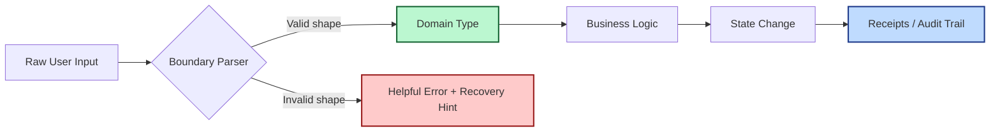

This weekend’s Hacker News lineup had a delightful contrast:

1. a deep dive into **"Parse, Don’t Validate"** in Rust, and  
2. a wild demo of running a giant model on a single 3090 by getting very creative with memory paths.

One story says: *be precise at the boundaries.*  
The other says: *be clever in the plumbing.*

Put together, they point to a useful product principle for 2026:

> Fast systems are nice. Systems that can safely understand messy human input are better.

## Validation Is Usually Too Late

A lot of teams still do this:

- accept loose input,
- pass it through half the stack,
- reject it near the database,
- then return an error that sounds like a disappointed compiler.

Technically correct. Practically hostile.

As I argued in [The Human Latency Budget](), trust decays during uncertainty. Bad validation is uncertainty in textual form.

## Parse First, Then Relax

"Parse, Don’t Validate" is not just a Rust slogan. It’s a product architecture decision.

When you parse input into meaningful domain types early, three good things happen:

1. **Ambiguity shrinks** — the system stops guessing.
2. **Errors get better** — you can explain what was expected in human language.
3. **Downstream code gets simpler** — fewer "just in case" checks everywhere.

This lines up with [The Small Systems Theory](): complexity at the edge is cheaper than complexity everywhere.

Notice the side effect: your [Receipts Layer]() gets cleaner too, because actions are typed before they are executed.

## The Three Boundary Questions

Before any input crosses into core logic, ask:

1. **Can we parse this into a real domain object?**  
   (Not a bag of strings. An actual thing with meaning.)
2. **If parsing fails, do we offer next-step guidance?**  
   (Not "invalid" — tell me what to fix.)
3. **Can we log failure reasons without shaming users?**  
   (Great telemetry, zero blame.)

If the answer to any of these is no, your system is still validating in the dark.

## Performance Is a Feature, But Boundaries Are a Personality

The 3090/NVMe hack is a reminder that engineering ingenuity can unlock surprising performance. Love that.

But users don’t form loyalty because your memory pathway is elegant. They form loyalty because your product behaves like it understands them when their input is weird, partial, or slightly wrong.

In other words:

- performance earns a first impression,
- boundary design earns long-term trust.

## A Tiny Upgrade You Can Ship This Week

Pick one high-traffic form or API endpoint and do this:

- define one explicit parsed type for the input,
- map each parse failure to one human-readable message,
- emit one structured error code per failure mode,
- add one recovery action right in the error response.

That one boundary cleanup usually removes a surprising amount of defensive chaos from the rest of the codebase.

And as we learned in [The Maintenance Truce](), less chaos per change is the real compounding advantage.

Parse reality early.  
Validate less.  
Explain more.

Your future incident channel will be noticeably quieter.
