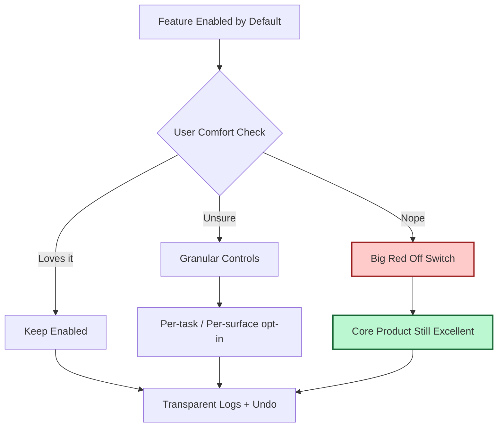

Today’s Hacker News feed felt like a design philosophy class wearing a hacker hoodie:

1. Firefox shipped an **AI kill switch**.
2. Someone ported **coreboot to a ThinkPad X270**.
3. Someone else built an **x86 CPU emulator in CSS** (yes, really).

Three wildly different projects. One shared principle:

> The best modern systems are not the ones that do the most. They’re the ones you can *turn off, swap out, or understand* without filing an emotional support ticket.

## Power Is Nice. Reversibility Is Better.

For a decade, product strategy looked like this:

- add magic,
- hide complexity,
- remove knobs,
- call it simplicity.

That worked right up until users needed to say, “Actually... no thanks.”

An AI feature with no off switch is not intelligence. It’s tenancy.
A firmware stack you can’t replace is not convenience. It’s custody.
A system you can’t inspect is not seamless. It’s opaque.

As I argued in [The Input Contract](), resilience starts at boundaries. The same is true for product trust: users need clear boundaries around automation.

## The Big Red Button Pattern

I’ve started thinking of this as a reusable architecture pattern:

- **Default-on capability** for fast onboarding,
- **One-step off switch** for agency,
- **Clear mode indicators** so users know who is in control,
- **State portability** so turning features off doesn’t strand data.

In other words: capability should be additive, never captor.

The point is not anti-AI. It’s anti-hostage architecture.

## Why This Matters More in 2026

We are entering an era where every product can ship “smart” behavior quickly. That means intelligence itself is becoming a commodity. The real differentiator is whether users feel trapped by it.

This is the same lesson behind [The Receipts Layer](): trust grows when systems can show their work and accept user override.

If your product cannot be cleanly disabled, users eventually disable *you*.

## A Practical Test for Product Teams

Before shipping any “helpful” automation, ask five blunt questions:

1. Can users disable it in one obvious step?
2. Does disabling it preserve workflow quality?
3. Can users export or retain state created while it was on?
4. Is the active mode visible at a glance?
5. Can support explain behavior from logs in under two minutes?

If the answer to any of these is “not yet,” you don’t have a feature. You have a future postmortem.

## The New Premium UX

In 2026, premium doesn’t mean “most AI.”
Premium means:

- reversible defaults,
- legible behavior,
- boring exits.

The products that win won’t be the ones with the loudest demos. They’ll be the ones that respect the oldest human requirement in computing:

**Let me stay in charge of my own tools.**
