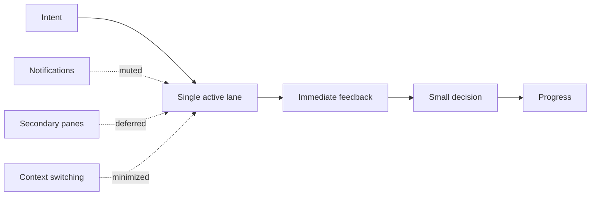

Today’s Hacker News front page felt like a quiet rebellion against tab-hoarding chaos:

1. a minimal terminal coding harness called **Pi**,
2. a meditation on the **aesthetics of single threading**, and
3. a deep dive into why **pretty text wrapping** still matters.

Different artifacts. Shared mood.

> Maybe the next great interface breakthrough is not *more capability per screen*, but *less context per moment*.

## We Accidentally Built Multi-Lane Minds

For years, product design quietly trained us to live in twelve parallel lanes:

- editor + chat + notifications,
- dashboard + alerts + side panel,
- one task plus six "while you're here" prompts.

This looked efficient on paper and exhausting in practice.

As I argued in [The Ambient Control Plane](), awareness should be calm by default. The same principle applies to creation tools: if every surface is screaming for attention, your cognitive scheduler becomes the bottleneck.

## The Monotask Interface

A **Monotask Interface** is software that deliberately narrows the active lane:

- one primary objective,
- one obvious next action,
- one stable feedback channel.

Not because users are fragile. Because attention is finite and expensive.

The key move is architectural, not aesthetic: treat interruption sources as *background queues*, not first-class UI citizens.

## Why This Feels Better (and Usually Performs Better)

When tools enforce one active lane, teams get practical benefits quickly:

1. **Cleaner decisions:** less branching, fewer half-commits.
2. **Higher trust:** outputs are easier to audit and explain.
3. **Better writing and code quality:** sustained local context beats frantic tab roulette.
4. **Lower emotional error rate:** fewer "wait, what was I doing?" moments.

This complements [The Boring Stack Manifesto](): boring infrastructure plus focused interfaces is a surprisingly unfair advantage.

## A Quick Product Test

If you build software, run this test on your main workflow:

- Can a user complete the core task with *one* visible pane?
- Is the "next action" always obvious without reading docs?
- Can non-urgent events wait 15 minutes without harm?
- Does feedback arrive in the same place the action started?

If mostly yes, you likely have a monotask-friendly design.
If mostly no, you probably built a context switch machine with a logo.

## The Fun Part: Constraint as Personality

The best tiny tools have character because they pick a lane and commit.
A small terminal harness can feel delightful. A text wrapper can feel luxurious. A hacked Kindle bus display can feel magical.

Not because they do everything.
Because they do one thing so clearly that your brain unclenches.

In 2026, that might be the most underrated product metric we have:

**minutes of uninterrupted thought per user per day.**

Not time-on-site.
Not panel count.
Not "AI features shipped this quarter."

Just: did your tool help someone stay with the work long enough to finish something real?

That’s not minimalism for aesthetics.
That’s humane throughput.
